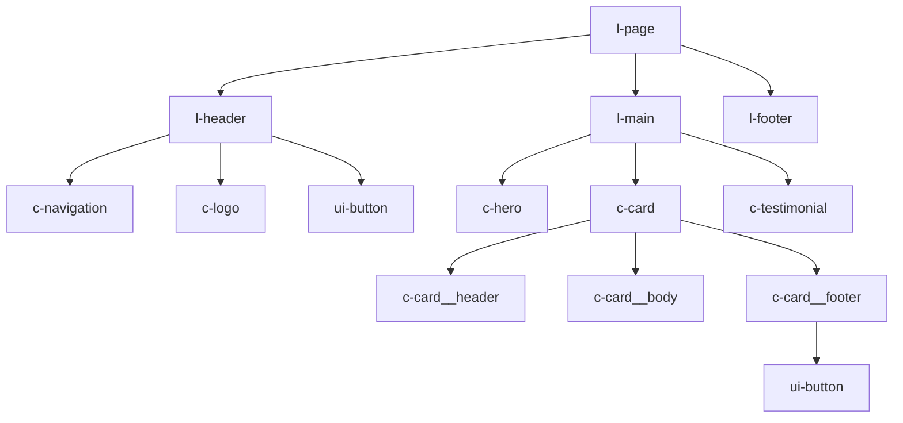
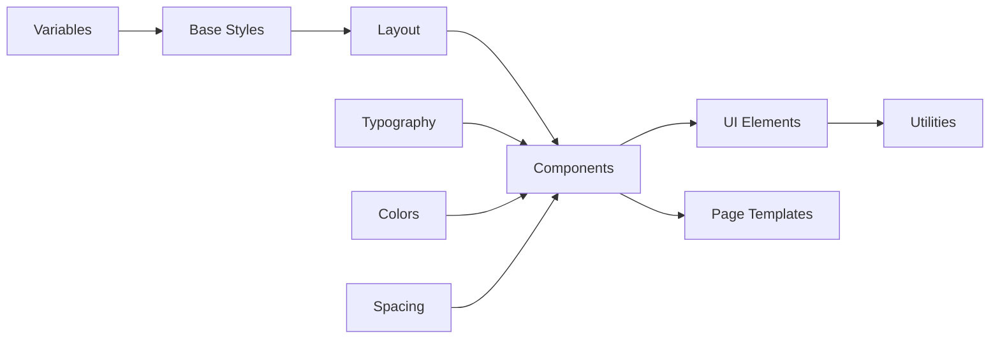

# CSS Component Hierarchy

## Visual Component Architecture

This document illustrates the complete component hierarchy and relationships in the semantic CSS architecture, showing how components are organized, nested, and interact.

## Component Tree Structure

```
┌─────────────────────────────────────────────────┐
│                    LAYOUT (l-)                   │
├─────────────────────────────────────────────────┤
│  ┌──────────────────────────────────────────┐   │
│  │              l-page                      │   │
│  ├──────────────────────────────────────────┤   │
│  │  ┌────────────────────────────────────┐  │   │
│  │  │         l-header                   │  │   │
│  │  │  ┌──────────────────────────────┐  │  │   │
│  │  │  │   c-navigation (primary)     │  │  │   │
│  │  │  │   c-logo                     │  │  │   │
│  │  │  │   ui-button (CTA)            │  │  │   │
│  │  │  └──────────────────────────────┘  │  │   │
│  │  └────────────────────────────────────┘  │   │
│  │                                          │   │
│  │  ┌────────────────────────────────────┐  │   │
│  │  │         l-main                     │  │   │
│  │  │  ┌──────────────────────────────┐  │  │   │
│  │  │  │   l-container                │  │  │   │
│  │  │  │   ┌──────────────────────┐   │  │  │   │
│  │  │  │   │  COMPONENTS (c-)     │   │  │  │   │
│  │  │  │   └──────────────────────┘   │  │  │   │
│  │  │  └──────────────────────────────┘  │  │   │
│  │  └────────────────────────────────────┘  │   │
│  │                                          │   │
│  │  ┌────────────────────────────────────┐  │   │
│  │  │         l-footer                   │  │   │
│  │  └────────────────────────────────────┘  │   │
│  └──────────────────────────────────────────┘   │
└─────────────────────────────────────────────────┘
```

## Component Categories

### 1. Layout Components (l-*)

Primary structural components that define page layout:

```
l-page
├── l-header
│   ├── l-header__inner
│   └── l-header__content
├── l-main
│   ├── l-container
│   ├── l-sidebar
│   └── l-content
└── l-footer
    ├── l-footer__top
    ├── l-footer__middle
    └── l-footer__bottom
```

### 2. Content Components (c-*)

Reusable content blocks and modules:

```
c-hero
├── c-hero__background
├── c-hero__content
├── c-hero__title
├── c-hero__subtitle
├── c-hero__cta
└── c-hero__image

c-card
├── c-card__header
│   └── c-card__title
├── c-card__body
│   └── c-card__text
├── c-card__footer
│   └── c-card__actions
└── c-card__image

c-testimonial
├── c-testimonial__quote
├── c-testimonial__author
│   ├── c-testimonial__name
│   └── c-testimonial__role
└── c-testimonial__image

c-service
├── c-service__icon
├── c-service__title
├── c-service__description
└── c-service__link
```

### 3. UI Components (ui-*)

Interactive interface elements:

```
ui-button
├── ui-button__icon
├── ui-button__text
└── ui-button__badge

ui-form
├── ui-form__group
│   ├── ui-form__label
│   ├── ui-form__input
│   ├── ui-form__help
│   └── ui-form__error
├── ui-form__actions
└── ui-form__fieldset

ui-modal
├── ui-modal__backdrop
├── ui-modal__dialog
│   ├── ui-modal__header
│   │   ├── ui-modal__title
│   │   └── ui-modal__close
│   ├── ui-modal__body
│   └── ui-modal__footer
└── ui-modal__trigger

ui-tabs
├── ui-tabs__list
│   └── ui-tabs__tab
└── ui-tabs__panels
    └── ui-tabs__panel
```

### 4. Navigation Components

Special navigation-specific components:

```
c-navigation
├── c-navigation__list
│   ├── c-navigation__item
│   │   ├── c-navigation__link
│   │   └── c-navigation__dropdown
│   │       ├── c-navigation__trigger
│   │       └── c-navigation__menu
│   │           └── c-navigation__submenu-item
│   └── c-navigation__divider
├── c-navigation__toggle (mobile)
└── c-navigation__brand

c-breadcrumb
├── c-breadcrumb__list
├── c-breadcrumb__item
├── c-breadcrumb__link
└── c-breadcrumb__separator

c-pagination
├── c-pagination__list
├── c-pagination__item
├── c-pagination__link
├── c-pagination__prev
├── c-pagination__next
└── c-pagination__ellipsis
```

## Component Relationships

### Parent-Child Relationships



### Component Composition

```html
<!-- Example: Service Card Component -->
<article class="c-card c-card--service">
  <header class="c-card__header">
    <div class="c-service__icon">
      <!-- SVG icon -->
    </div>
    <h3 class="c-card__title">Service Name</h3>
  </header>

  <div class="c-card__body">
    <p class="c-card__text">Service description...</p>
    <ul class="c-service__features">
      <li class="c-service__feature">Feature 1</li>
      <li class="c-service__feature">Feature 2</li>
    </ul>
  </div>

  <footer class="c-card__footer">
    <a href="#" class="ui-button ui-button--primary">
      Learn More
    </a>
  </footer>
</article>
```

## Component States & Modifiers

### State Hierarchy

```
Component Base
├── Modifiers (--modifier)
│   ├── c-card--featured
│   ├── c-card--compact
│   └── c-card--horizontal
└── States (is-*, has-*)
    ├── is-active
    ├── is-loading
    ├── is-disabled
    └── has-error
```

### Modifier Patterns

```css
/* Size Modifiers */
.c-component--small
.c-component--medium (default)
.c-component--large

/* Theme Modifiers */
.c-component--primary
.c-component--secondary
.c-component--dark

/* Layout Modifiers */
.c-component--centered
.c-component--full-width
.c-component--inline

/* State Modifiers */
.c-component.is-active
.c-component.is-loading
.c-component.is-error
```

## Component Naming Matrix

| Component | Block | Element | Modifier | Example |
|-----------|-------|---------|----------|---------|
| Layout | `l-header` | `l-header__inner` | `l-header--sticky` | `l-header--sticky` |
| Navigation | `c-navigation` | `c-navigation__item` | `c-navigation--mobile` | `c-navigation__item--active` |
| Card | `c-card` | `c-card__title` | `c-card--featured` | `c-card--featured` |
| Button | `ui-button` | `ui-button__icon` | `ui-button--primary` | `ui-button--large` |
| Form | `ui-form` | `ui-form__input` | `ui-form--inline` | `ui-form__input--error` |
| Hero | `c-hero` | `c-hero__title` | `c-hero--centered` | `c-hero--video` |

## Component File Organization

```
themes/beaver/assets/css/
├── components/
│   ├── layout/
│   │   ├── _l-page.css
│   │   ├── _l-header.css
│   │   ├── _l-main.css
│   │   ├── _l-footer.css
│   │   └── _l-container.css
│   │
│   ├── content/
│   │   ├── _c-hero.css
│   │   ├── _c-card.css
│   │   ├── _c-testimonial.css
│   │   ├── _c-service.css
│   │   ├── _c-team.css
│   │   └── _c-article.css
│   │
│   ├── ui/
│   │   ├── _ui-button.css
│   │   ├── _ui-form.css
│   │   ├── _ui-modal.css
│   │   ├── _ui-tabs.css
│   │   ├── _ui-accordion.css
│   │   └── _ui-tooltip.css
│   │
│   └── navigation/
│       ├── _c-navigation.css
│       ├── _c-breadcrumb.css
│       ├── _c-pagination.css
│       └── _c-menu.css
```

## Component Dependencies

### Dependency Graph



### Import Order

```css
/* main.css */

/* 1. Settings - Variables and configuration */
@import 'settings/variables';
@import 'settings/colors';
@import 'settings/typography';
@import 'settings/breakpoints';

/* 2. Tools - Mixins and functions */
@import 'tools/mixins';
@import 'tools/functions';

/* 3. Generic - Reset and normalize */
@import 'generic/reset';
@import 'generic/box-sizing';

/* 4. Elements - HTML element styles */
@import 'elements/page';
@import 'elements/headings';
@import 'elements/links';

/* 5. Objects - Layout patterns */
@import 'objects/container';
@import 'objects/grid';
@import 'objects/media';

/* 6. Components - UI components */
@import 'components/layout/index';
@import 'components/content/index';
@import 'components/ui/index';
@import 'components/navigation/index';

/* 7. Utilities - Helper classes */
@import 'utilities/index';
```

## Responsive Component Behavior

### Breakpoint Strategy

```css
/* Mobile First Approach */
.c-component {
  /* Mobile styles (default) */
}

@media (min-width: 640px) {  /* sm */
  .c-component {
    /* Small tablet adjustments */
  }
}

@media (min-width: 768px) {  /* md */
  .c-component {
    /* Tablet adjustments */
  }
}

@media (min-width: 1024px) { /* lg */
  .c-component {
    /* Desktop adjustments */
  }
}

@media (min-width: 1280px) { /* xl */
  .c-component {
    /* Large desktop adjustments */
  }
}
```

### Component Responsive Patterns

```css
/* Navigation: Horizontal to Hamburger */
.c-navigation {
  /* Mobile: Hamburger menu */
  position: fixed;
  transform: translateX(-100%);
}

@media (min-width: 768px) {
  .c-navigation {
    /* Desktop: Horizontal menu */
    position: static;
    transform: none;
    display: flex;
  }
}

/* Cards: Stack to Grid */
.c-card-grid {
  /* Mobile: Stacked */
  display: block;
}

@media (min-width: 768px) {
  .c-card-grid {
    /* Desktop: Grid */
    display: grid;
    grid-template-columns: repeat(3, 1fr);
    gap: 2rem;
  }
}
```

## Component Testing Matrix

| Component | Unit Test | Visual Test | A11y Test | Performance |
|-----------|-----------|-------------|-----------|-------------|
| l-header | ✓ | ✓ | ✓ | ✓ |
| c-navigation | ✓ | ✓ | ✓ | ✓ |
| c-card | ✓ | ✓ | ✓ | ✓ |
| ui-button | ✓ | ✓ | ✓ | ✓ |
| ui-form | ✓ | ✓ | ✓ | ✓ |
| c-hero | ✓ | ✓ | ✓ | ✓ |

## Performance Optimization

### Component Loading Strategy

```html
<!-- Critical Components (inline) -->
<style>
  /* Layout components */
  .l-page { ... }
  .l-header { ... }
  .c-navigation { ... }
</style>

<!-- Non-critical Components (async) -->
<link rel="preload" href="/css/components.css" as="style" onload="this.onload=null;this.rel='stylesheet'">
```

### Component Bundle Sizes

| Bundle | Components | Size (gzip) |
|--------|------------|-------------|
| critical.css | Layout, Navigation | ~3kb |
| components.css | All content components | ~12kb |
| ui.css | Interactive components | ~8kb |
| utilities.css | Utility classes | ~6kb |

## Migration Path from Legacy

### Legacy to Semantic Mapping

| Legacy Pattern | Semantic Replacement |
|----------------|---------------------|
| `.fl-row` | `.l-row` |
| `.fl-col` | `.l-col` |
| `.fl-module` | `.c-module` |
| `.fl-module-heading` | `.c-heading` |
| `.pp-tabs` | `.ui-tabs` |
| `.pp-infobox` | `.c-infobox` |
| `.uabb-info-box` | `.c-card--info` |
| `.fl-builder-content` | `.l-content` |

## Conclusion

This component hierarchy provides a clear, maintainable structure for the entire CSS architecture. Each component has a defined role, clear naming convention, and predictable behavior, making development and maintenance straightforward and efficient.