# Visual QA Iterative Improvement Workflow How-To
*How-To-Oriented Content - AC.ID: 50.10*

## 🌐 Global Handbook Compliance (Supreme Authority)

**Global References**:
- `/knowledge/20.01-tdd-methodology-reference.md` (SUPREME AUTHORITY)
- `/knowledge/20.02-four-eyes-principle-global.md` (SUPREME AUTHORITY)
- `/knowledge/50.01-global-file-management.md` (SUPREME AUTHORITY)

**Authority Resolution**: Global testing methodology and quality standards supersede project-specific QA preferences
**Extension Statement**: This QA workflow extends Global testing standards with visual validation-specific procedures
**Key Compliance**: Implements Global TDD principles, Global four-eyes principle, and Global quality gate enforcement

## 🎯 Purpose

This document provides a step-by-step iterative workflow for visual quality improvements using the Visual QA Validation Framework. It ensures safe, measurable improvements while preventing regression through automated rollback procedures, all while maintaining full compliance with Global Handbook testing and quality standards.

## 🔄 Core Workflow Principles

### Zero-Defect Methodology
- **Fail Fast**: Detect issues immediately with objective scoring
- **Safe Iterations**: Small changes with immediate verification
- **Automatic Rollback**: Revert changes if quality decreases
- **Continuous Verification**: Quality gates at every step

### Conservative Validation
- **Baseline Protection**: Never allow score regression
- **Measurement-Driven**: Objective criteria over subjective assessment
- **Risk Minimization**: One change at a time, verify before proceeding
- **Evidence-Based**: Document all decisions with data

## 📊 Workflow Overview

```mermaid
graph TD
    A[Initial Assessment] --> B{Score ≥ 7?}
    B -->|Yes| C[Production Ready]
    B -->|No| D[Improvement Required]
    D --> E[Identify Issues]
    E --> F[Select Highest Impact]
    F --> G[Apply Single Fix]
    G --> H[Verify Changes]
    H --> I{Score Improved?}
    I -->|Yes| J[Commit Changes]
    I -->|No| K[Rollback Changes]
    J --> L{Score ≥ 9?}
    K --> M[Try Alternative Fix]
    L -->|Yes| N[Excellence Achieved]
    L -->|No| E
    M --> G
```



## 🚀 Step-by-Step Implementation

### Phase 1: Initial Assessment

#### 1.1 Run Baseline Validation
```bash
# Generate initial quality assessment
./bin/visual-qa-validate

# Expected output:
# 📊 Overall Score: X.X/10 (Grade: X)
# Quality Level: [description]
# Screenshots: X analyzed
```

#### 1.2 Interpret Results
```bash
# Score interpretation:
# 9.0-10.0: Excellent - Minor optimizations only
# 7.0-8.9:  Good - Targeted improvements beneficial
# 5.0-6.9:  Poor - Systematic improvements required
# 0.0-4.9:  Critical - Major issues must be resolved
```

#### 1.3 Decision Point
```ruby
if overall_score >= 9.0
  puts "✅ Production ready - consider optimization opportunities"
  workflow = :optimization
elsif overall_score >= 7.0
  puts "🎯 Good foundation - targeted improvements recommended"
  workflow = :improvement
else
  puts "🚨 Critical issues - systematic fixes required"
  workflow = :remediation
end
```

### Phase 2: Issue Analysis & Prioritization

#### 2.1 Generate Improvement Plan
```bash
# Get detailed improvement guidance
./bin/visual-qa-validate --improve

# Expected output:
# 📊 Current Overall Score: X.X/10
# 🎯 Improvement Targets:
#    1. [Category]: [Description] - Impact: [High/Medium/Low]
#    2. [Category]: [Description] - Impact: [High/Medium/Low]
```

#### 2.2 Prioritize Issues by Impact

**High Impact Issues (Fix First)**
- File size anomalies (>5MB or <10KB)
- Missing critical elements in screenshots
- Browser timing/loading issues
- Screenshot capture failures

**Medium Impact Issues (Fix Second)**
- Minor timing inconsistencies
- Viewport configuration problems
- Cross-browser rendering differences
- Quality variance between sections

**Low Impact Issues (Optimize Later)**
- File naming inconsistencies
- Minor compression variations
- Negligible visual differences
- Performance optimizations

#### 2.3 Select Single Issue
```ruby
# Always fix highest impact issue first
selected_issue = issues.sort_by { |issue| impact_priority(issue[:impact]) }.first

puts "🎯 Targeting: #{selected_issue[:category]} - #{selected_issue[:description]}"
puts "📋 Fix Strategy: #{selected_issue[:fix_suggestion]}"
```

### Phase 3: Implementation

#### 3.1 Pre-Change Safety Check
```bash
# Ensure clean git state for safe rollback
git status

# Expected: working tree clean
# If not clean: commit or stash changes first
```

#### 3.2 Apply Single Fix

**For File Size Issues:**
```ruby
# Common fixes:
# 1. Adjust browser viewport settings
page.driver.browser.manage.window.resize_to(1920, 1080)

# 2. Add proper wait conditions
wait_for_page_load
assert_text "expected content"  # Ensures page fully loaded

# 3. Optimize screenshot timing
sleep 0.5 if ENV['VISUAL_TESTING']
```

**For Loading/Timing Issues:**
```ruby
# Enhanced wait strategies
def wait_for_page_load
  # Wait for critical elements
  assert_text "How we see the world helps drive our success"

  # Wait for images to load
  page.execute_script("return document.readyState") == "complete"

  # Additional stability wait
  sleep 1.0
end
```

**For Consistency Issues:**
```ruby
# Standardize capture conditions
def capture_element_screenshot(element, name)
  # Ensure element is in viewport
  element.execute_script("arguments[0].scrollIntoView({block: 'center'});", element.native)

  # Wait for animations/transitions
  sleep 0.5

  # Capture with consistent naming
  path = "#{SCREENSHOTS_DIR}/section_#{name}_#{timestamp}.png"
  element.save_screenshot(path)
  path
end
```

#### 3.3 Single Change Principle
```ruby
# ✅ CORRECT: One focused change
def improve_screenshot_quality
  # Change ONLY viewport size
  Capybara.current_driver = :desktop_chrome_1920x1080
end

# ❌ INCORRECT: Multiple changes at once
def improve_screenshot_quality
  Capybara.current_driver = :desktop_chrome_1920x1080  # viewport change
  sleep 2.0                                            # timing change
  page.execute_script("window.scrollTo(0, 0)")        # scroll change
end
```

### Phase 4: Verification

#### 4.1 Run Verification Check
```bash
# Verify improvement against baseline
./bin/visual-qa-validate --verify

# Expected output:
# 📊 Score Comparison:
#    Previous: X.X/10
#    Current:  Y.Y/10
#    Change:   +/-Z.Z
```

#### 4.2 Interpret Verification Results

**✅ Improvement Confirmed (Score Increased)**
```bash
# Example output:
# 📊 Score Comparison:
#    Previous: 7.2/10
#    Current:  7.8/10
#    Change:   +0.6
#
# ✅ IMPROVEMENT VERIFIED - Changes are beneficial
#    Recommendation: Commit these changes

# Action: Proceed to commit
git add .
git commit -m "Visual QA: Fix viewport sizing - Score improved 7.2→7.8"
```

**⚠️ Regression Detected (Score Decreased)**
```bash
# Example output:
# 📊 Score Comparison:
#    Previous: 7.2/10
#    Current:  6.8/10
#    Change:   -0.4
#
# ⚠️ QUALITY REGRESSION DETECTED
#    Recommendation: Rollback changes with 'git checkout -- .'

# Action: Immediate rollback
git checkout -- .
git status  # Verify clean state
```

**🔄 No Change (Score Same)**
```bash
# Example output:
# 📊 Score Comparison:
#    Previous: 7.2/10
#    Current:  7.2/10
#    Change:   0.0
#
# 🔄 NO IMPROVEMENT DETECTED
#    Recommendation: Try alternative approach

# Action: Try different fix strategy
```

### Phase 5: Iteration Decision

#### 5.1 Post-Verification Actions

**If Improvement Confirmed:**
```bash
# 1. Commit successful changes
git add .
git commit -m "Visual QA: [description] - Score: [old]→[new]"

# 2. Update baseline for future comparisons
./bin/visual-qa-validate  # Generates new baseline

# 3. Check if target reached
if [ "$current_score" -ge 9 ]; then
  echo "🎉 Excellence achieved! Score: $current_score/10"
else
  echo "🔄 Continue with next highest-impact issue"
fi
```

**If Regression Detected:**
```bash
# 1. Immediate rollback (already done)
# 2. Analyze why fix failed
echo "❓ Analyzing fix failure..."

# 3. Try alternative approach
echo "🔄 Attempting alternative fix strategy..."
```

#### 5.2 Continue or Complete

**Continue Iteration (Score < 9.0):**
```bash
# Return to Phase 2: Issue Analysis
./bin/visual-qa-validate --improve

# Select next highest-impact issue
# Repeat phases 3-5
```

**Achieve Excellence (Score ≥ 9.0):**
```bash
# Document success
echo "🏆 Visual QA Excellence Achieved!"
echo "📊 Final Score: $score/10 (Grade A)"

# Optional: Continue for perfect score
if [ "$score" -lt 10 ]; then
  echo "💎 Consider minor optimizations for perfect score"
fi
```

## 🛡️ Safety Protocols

### Git Safety Procedures
```bash
# Before any changes
git status | grep "working tree clean" || {
  echo "⚠️ Working tree not clean"
  echo "Commit or stash changes before QA workflow"
  exit 1
}

# Before each fix attempt
git log -1 --oneline  # Note current commit
```

### Rollback Procedures
```bash
# Immediate rollback on regression
rollback_changes() {
  git checkout -- .
  git clean -fd
  git status
  echo "✅ Rollback complete - repository restored"
}

# Verify rollback success
verify_rollback() {
  ./bin/visual-qa-validate --verify
  # Should show original baseline score
}
```

### Validation Safety Checks
```bash
# Before accepting any changes
safety_check() {
  # 1. Verify tests still pass
  ./bin/test test/system/visual_quality_review_test.rb

  # 2. Verify Hugo builds successfully
  hugo --minify --destination _temp/safety_check

  # 3. Verify no broken functionality
  bundle exec rake test
}
```

## 📈 Performance Optimization

### Workflow Performance Targets
```ruby
# Target execution times
initial_assessment: "< 30 seconds"
improvement_analysis: "< 10 seconds"
single_fix_verification: "< 45 seconds"
full_iteration_cycle: "< 2 minutes"
```

### Optimization Strategies
```ruby
# Parallel screenshot capture
def capture_screenshots_efficiently
  sections.map do |section|
    Thread.new { capture_section_screenshot(section) }
  end.map(&:value)
end

# Incremental analysis
def analyze_only_changed_screenshots
  new_screenshots = find_screenshots_newer_than(last_baseline)
  analyze_screenshots(new_screenshots)
end
```

## 🎯 Success Patterns

### Typical Improvement Sequences

**Pattern 1: Technical Issues First**
```
7.2 → 8.1 (Fix file size issues)
8.1 → 8.7 (Fix timing problems)
8.7 → 9.3 (Optimize consistency)
```

**Pattern 2: Consistency Focus**
```
6.8 → 7.5 (Standardize viewport)
7.5 → 8.2 (Improve wait conditions)
8.2 → 9.1 (Fine-tune capture timing)
```

**Pattern 3: Quality Polish**
```
8.9 → 9.2 (Minor compression optimization)
9.2 → 9.6 (Perfect timing consistency)
9.6 → 10.0 (Pixel-perfect captures)
```

### Common Anti-Patterns to Avoid

**❌ Multiple Changes at Once**
```ruby
# Wrong: Can't isolate which change caused improvement/regression
def fix_everything_at_once
  fix_viewport_size
  fix_timing_issues
  fix_file_compression
  fix_consistency_problems
end
```

**❌ Ignoring Verification Results**
```ruby
# Wrong: Proceeding despite regression
if verification_shows_regression?
  puts "I'll commit anyway and hope it's fine"  # NEVER DO THIS
  commit_changes
end
```

**❌ Skipping Safety Checks**
```ruby
# Wrong: No git safety net
def make_changes_without_safety
  apply_fix
  # No git status check
  # No rollback plan
  # No verification
end
```

## 📊 Metrics & Reporting

### Track Improvement Progress
```ruby
improvement_log = {
  iteration_1: { from: 6.8, to: 7.2, change: +0.4, fix: "viewport sizing" },
  iteration_2: { from: 7.2, to: 7.8, change: +0.6, fix: "wait conditions" },
  iteration_3: { from: 7.8, to: 8.5, change: +0.7, fix: "capture timing" },
  iteration_4: { from: 8.5, to: 9.1, change: +0.6, fix: "consistency" }
}
```

### Quality Trend Analysis
```ruby
def analyze_improvement_trend(log)
  total_improvement = log.values.sum { |iter| iter[:change] }
  average_per_iteration = total_improvement / log.length

  puts "📈 Improvement Trend:"
  puts "   Total improvement: +#{total_improvement}"
  puts "   Average per iteration: +#{average_per_iteration.round(1)}"
  puts "   Iterations to excellence: #{((9.0 - current_score) / average_per_iteration).ceil}"
end
```

## 🏆 Completion Criteria

### Production Readiness (Minimum Standard)
- **Overall Score**: ≥ 7.0/10
- **Individual Scores**: All ≥ 6.0/10
- **Consistency**: Variance < 2.0 points
- **No Critical Issues**: Zero red flag indicators

### Excellence Achievement (Target Goal)
- **Overall Score**: ≥ 9.0/10
- **Individual Scores**: All ≥ 8.0/10
- **Consistency**: Variance < 1.0 point
- **Professional Quality**: Ready for client presentation

### Perfect Score Achievement (Optimization Goal)
- **Overall Score**: 10.0/10
- **Individual Scores**: All 10.0/10
- **Consistency**: Zero variance
- **Pixel Perfect**: No measurable differences

---

## 📖 Integration References

- **Validation Criteria**: `docs/visual-qa-criteria.md`
- **Main Validator**: `bin/visual-qa-validate`
- **Test Infrastructure**: `bin/test + test/system/visual_quality_review_test.rb`
- **Verification System**: `_verification/AGENT_UI_VERIFICATION_GUIDE.md`

---

## Document Metadata

- **AC.ID**: 50.10
- **Diátaxis Type**: how-to
- **Global Handbook References**:
  - `/knowledge/20.01-tdd-methodology-reference.md` (SUPREME AUTHORITY)
  - `/knowledge/20.02-four-eyes-principle-global.md` (SUPREME AUTHORITY)
  - `/knowledge/50.01-global-file-management.md` (SUPREME AUTHORITY)
- **Authority Level**: Secondary (extends Global standards)
- **Last Updated**: 2025-09-18
- **Cross-References**: [Global TDD methodology, Global four-eyes principle, Global quality gate enforcement]

*This workflow ensures safe, measurable visual quality improvements with automatic rollback protection while maintaining full compliance with Global Handbook testing and quality standards. Follow the step-by-step process for reliable results.*