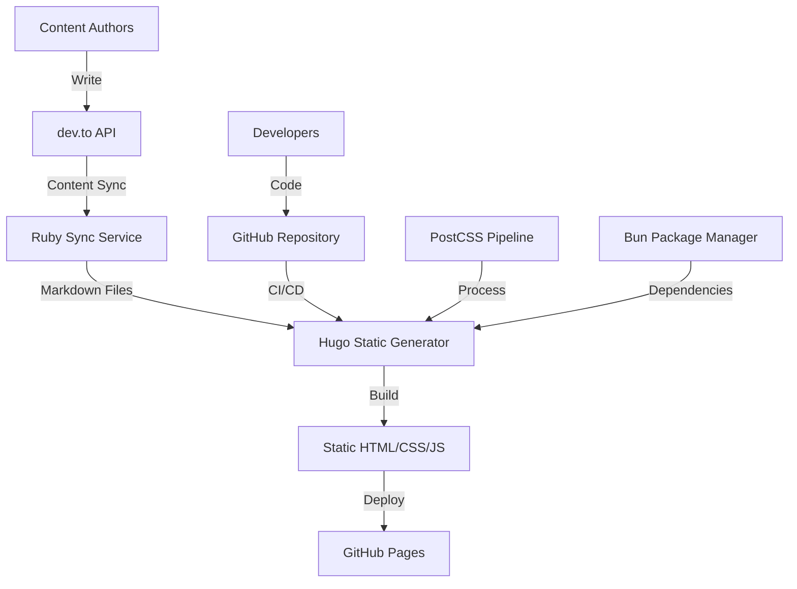
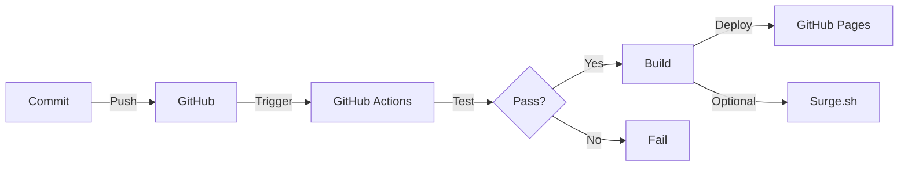

# JetThoughts Website - Technical Architecture

## Executive Summary

The JetThoughts website is a sophisticated Hugo-based static site generator with automated content synchronization, comprehensive testing, and modern CI/CD practices. This document details the technical architecture, design decisions, and implementation patterns.

## Table of Contents

- [System Architecture](#system-architecture)
- [Technology Stack](#technology-stack)
- [Core Components](#core-components)
- [Data Flow](#data-flow)
- [Content Management](#content-management)
- [Build Pipeline](#build-pipeline)
- [Testing Architecture](#testing-architecture)
- [Deployment Strategy](#deployment-strategy)
- [Security Considerations](#security-considerations)
- [Performance Optimizations](#performance-optimizations)

## System Architecture

### High-Level Overview



### Component Architecture

```
┌─────────────────────────────────────────────────┐
│                  Frontend Layer                  │
│  ┌──────────┐  ┌──────────┐  ┌──────────┐      │
│  │   HTML   │  │   CSS    │  │    JS    │      │
│  │  Pages   │  │  Styles  │  │ Scripts  │      │
│  └──────────┘  └──────────┘  └──────────┘      │
└─────────────────────────────────────────────────┘
┌─────────────────────────────────────────────────┐
│              Static Generation Layer             │
│  ┌──────────┐  ┌──────────┐  ┌──────────┐      │
│  │   Hugo   │  │  Beaver  │  │ PostCSS  │      │
│  │  Engine  │  │  Theme   │  │ Pipeline │      │
│  └──────────┘  └──────────┘  └──────────┘      │
└─────────────────────────────────────────────────┘
┌─────────────────────────────────────────────────┐
│               Content Layer                      │
│  ┌──────────┐  ┌──────────┐  ┌──────────┐      │
│  │ Markdown │  │   YAML   │  │  Assets  │      │
│  │  Files   │  │   Data   │  │  Images  │      │
│  └──────────┘  └──────────┘  └──────────┘      │
└─────────────────────────────────────────────────┘
┌─────────────────────────────────────────────────┐
│              Integration Layer                   │
│  ┌──────────┐  ┌──────────┐  ┌──────────┐      │
│  │  dev.to  │  │  GitHub  │  │  Google  │      │
│  │    API   │  │  Actions │  │  Forms   │      │
│  └──────────┘  └──────────┘  └──────────┘      │
└─────────────────────────────────────────────────┘
```

## Technology Stack

### Core Technologies

| Layer | Technology | Version | Purpose |
|-------|------------|---------|---------|
| **Static Generator** | Hugo | 0.147.9 Extended | Site generation |
| **Theme** | Beaver (Custom) | 1.0.0 | UI/UX framework |
| **Languages** | Go Templates | - | Templating |
| | Ruby | 3.0+ | Sync & testing |
| | JavaScript | ES6+ | Interactive features |
| **Package Managers** | Bun | Latest | Node dependencies |
| | Bundler | 2.x | Ruby dependencies |
| **CSS Processing** | PostCSS | 8.x | CSS pipeline |
| **Testing** | Minitest | 5.x | Test framework |
| | Capybara | 3.x | Browser automation |
| | Selenium | 4.x | WebDriver |
| **CI/CD** | GitHub Actions | - | Automation |
| **Hosting** | GitHub Pages | - | Production |
| | Surge.sh | - | Staging |

### Dependencies Matrix

```yaml
Production Dependencies:
  hugo: "0.147.9"
  postcss: "8.x"
  autoprefixer: "10.x"
  cssnano: "7.x"
  purgecss: "6.x"

Development Dependencies:
  prettier: "3.x"
  esbuild: "0.23.x"
  surge: "0.24.x"
  
Testing Dependencies:
  minitest: "5.x"
  capybara: "3.x"
  selenium-webdriver: "4.x"
  simplecov: "0.x"
```

## Core Components

### 1. Hugo Static Site Generator

**Purpose**: Transform markdown content and templates into static HTML

**Configuration** (`hugo.toml`):
```toml
baseURL = "https://jetthoughts.com/"
theme = "beaver"
enableGitInfo = true

[build]
  writeStats = true
  
[build.processing.css]
  bundle = true
```

**Key Features**:
- Git integration for last modified dates
- Build statistics for optimization
- CSS bundling and processing
- Multi-level menu support

### 2. Beaver Theme

**Structure**:
```
themes/beaver/
├── layouts/
│   ├── _default/
│   ├── partials/
│   ├── shortcodes/
│   └── page/
├── assets/
│   ├── css/
│   ├── js/
│   └── img/
└── archetypes/
```

**Components**:
- Responsive grid system
- Dropdown navigation
- Form integrations
- SEO optimizations
- Performance enhancements

### 3. Content Synchronization Service

**Architecture**:
```ruby
module Sync
  class DevToSync
    def sync_articles
      discover_changes
      download_content
      process_markdown
      update_canonical_urls
      cleanup_old_content
    end
  end
end
```

**Features**:
- Incremental sync
- Image localization
- URL mapping
- Status tracking
- Error recovery

### 4. PostCSS Pipeline

**Processing Chain**:
```javascript
module.exports = {
  plugins: [
    require('postcss-nested'),
    require('autoprefixer'),
    require('@fullhuman/postcss-purgecss')({
      content: ['./layouts/**/*.html']
    }),
    require('cssnano')({
      preset: 'default'
    })
  ]
}
```

## Data Flow

### Content Creation Flow

```
1. Author writes on dev.to
   ↓
2. GitHub Action triggers (10 min interval)
   ↓
3. Ruby sync service fetches new/updated articles
   ↓
4. Content processed and saved as markdown
   ↓
5. Images downloaded and localized
   ↓
6. Git commit with changes
   ↓
7. Hugo builds static site
   ↓
8. Deploy to GitHub Pages
```

### Build Process Flow

```
1. Source files change detected
   ↓
2. GitHub Actions workflow triggered
   ↓
3. Dependencies installed (cached)
   ↓
4. Hugo build with minification
   ↓
5. PostCSS processing
   ↓
6. Tests executed
   ↓
7. Artifacts uploaded
   ↓
8. Deploy to hosting
```

## Content Management

### Content Structure

```
content/
├── _index.md           # Homepage
├── blog/              # Blog posts (540+)
│   ├── _index.md     # Blog listing
│   ├── sync_status.yml # Sync tracking
│   └── [slug]/       # Individual posts
│       └── index.md  # Post content
├── pages/            # Static pages
├── services/         # Service pages
├── clients/          # Case studies
└── use-cases/        # Use examples
```

### Front Matter Schema

```yaml
# Blog Post
---
title: "Post Title"
slug: "url-slug"
date: 2024-01-01
author: "Author Name"
description: "SEO description"
tags: ["tag1", "tag2"]
cover_image: "image.jpg"
canonical_url: "https://jetthoughts.com/blog/url-slug/"
remote:
  source: "dev.to"
  id: 123456
  updated_at: "2024-01-01T00:00:00Z"
---
```

### Archetype System

Provides templates for content types:
- `default.md` - Standard pages
- `services.md` - Service descriptions
- `clients.md` - Client case studies
- `careers.md` - Job postings
- `use-cases.md` - Use case examples

## Build Pipeline

### Local Development

```bash
# Install dependencies
bin/setup

# Start development server
hugo server -D --renderStaticToDisk

# Build for production
hugo --minify --gc
```

### CI/CD Pipeline

```yaml
Workflow Steps:
1. Checkout code
2. Setup Hugo (extended)
3. Install Bun
4. Cache dependencies
5. Install packages
6. Build site
7. Run tests
8. Upload artifacts
9. Deploy to GitHub Pages
```

### Build Optimizations

- **Caching**: Hugo modules, node_modules, gems
- **Parallelization**: Concurrent job execution
- **Incremental builds**: Only rebuild changed content
- **Asset optimization**: Minification, compression
- **Unused CSS removal**: PurgeCSS integration

## Testing Architecture

### Test Levels

```
┌─────────────────────────────────────┐
│          E2E Tests                  │
│    (Capybara + Selenium)           │
├─────────────────────────────────────┤
│       Integration Tests             │
│    (API clients, sync logic)       │
├─────────────────────────────────────┤
│         Unit Tests                  │
│    (Ruby components, helpers)      │
└─────────────────────────────────────┘
```

### Test Configuration

```ruby
# Browser configuration
Capybara.register_driver :chrome_headless do |app|
  options = Selenium::WebDriver::Chrome::Options.new
  options.add_argument('--headless')
  options.add_argument('--disable-gpu')
  options.add_argument('--no-sandbox')
  
  Capybara::Selenium::Driver.new(app,
    browser: :chrome,
    options: options
  )
end
```

### Visual Regression Testing

```ruby
class TestHomepage < SystemTest
  include Capybara::Screenshot::Diff
  
  def test_homepage_desktop
    visit '/'
    screenshot 'homepage-desktop'
  end
  
  def test_homepage_mobile
    page.driver.browser.manage.window.resize_to(375, 812)
    visit '/'
    screenshot 'homepage-mobile'
  end
end
```

## Deployment Strategy

### Environments

| Environment | Branch | URL | Purpose |
|------------|--------|-----|---------|
| **Production** | master | jetthoughts.com | Live site |
| **Staging** | Any | *.surge.sh | Testing |
| **Development** | Local | localhost:1313 | Development |

### Deployment Flow



### Rollback Strategy

```bash
# Revert to previous commit
git revert HEAD
git push origin master

# Or restore from GitHub Pages history
# GitHub automatically keeps deployment history
```

## Security Considerations

### Access Control

- **Repository**: Protected branches, PR reviews required
- **Secrets**: GitHub Secrets for API keys
- **Forms**: Google Forms with validation
- **Content**: Sanitized markdown processing

### Security Headers

Configured via `_headers` file:
```
/*
  X-Frame-Options: SAMEORIGIN
  X-Content-Type-Options: nosniff
  Referrer-Policy: strict-origin-when-cross-origin
```

### Dependency Management

- **Dependabot**: Automated security updates
- **Lock files**: Pinned dependencies
- **Audit**: Regular security audits

```bash
# Ruby audit
bundle audit

# Node audit
bun audit
```

## Performance Optimizations

### Build-Time Optimizations

- **PurgeCSS**: Remove unused CSS (~70% reduction)
- **Minification**: HTML, CSS, JS minification
- **Image optimization**: Compressed images
- **Asset bundling**: Combined CSS/JS files

### Runtime Optimizations

- **Static hosting**: CDN distribution via GitHub
- **Caching headers**: Browser caching
- **Lazy loading**: Images load on demand
- **Critical CSS**: Inline critical styles

### Performance Metrics

```yaml
Lighthouse Scores (Target):
  Performance: >90
  Accessibility: >95
  Best Practices: >95
  SEO: >95
  
Page Load Times:
  First Contentful Paint: <1.5s
  Time to Interactive: <3.5s
  Cumulative Layout Shift: <0.1
```

### Monitoring

- **Build statistics**: Hugo stats.json
- **GitHub Actions metrics**: Workflow analytics
- **Error tracking**: GitHub Issues integration
- **Performance tracking**: Lighthouse CI

## Architecture Decisions

### ADR-001: Hugo as Static Site Generator

**Status**: Accepted

**Context**: Need fast, maintainable static site generator

**Decision**: Use Hugo for its speed and flexibility

**Consequences**:
- ✅ Fast build times (<3s for 500+ pages)
- ✅ Rich templating system
- ✅ Active community
- ❌ Go template learning curve

### ADR-002: dev.to as Content Source

**Status**: Accepted

**Context**: Need content management without custom CMS

**Decision**: Use dev.to as headless CMS

**Consequences**:
- ✅ No CMS maintenance
- ✅ Built-in editor and collaboration
- ✅ API access for automation
- ❌ Dependency on third-party service

### ADR-003: GitHub Pages for Hosting

**Status**: Accepted

**Context**: Need reliable, free hosting

**Decision**: Use GitHub Pages for production

**Consequences**:
- ✅ Free hosting with SSL
- ✅ Integrated with repository
- ✅ Automatic deployments
- ❌ Limited server-side features

## Future Considerations

### Planned Improvements

1. **Performance**:
   - Implement service workers
   - Add resource hints (prefetch/preconnect)
   - Optimize critical rendering path

2. **Features**:
   - Search functionality
   - Newsletter integration
   - Analytics dashboard

3. **Architecture**:
   - Migrate to Hugo modules
   - Implement design system
   - Add API endpoints

### Scalability Considerations

- **Content growth**: Optimize build for 1000+ pages
- **Traffic growth**: Consider CDN options
- **Team growth**: Improve collaboration tools
- **Feature growth**: Maintain modular architecture

## Maintenance

### Regular Tasks

- **Weekly**: Dependency updates
- **Monthly**: Performance audit
- **Quarterly**: Security review
- **Yearly**: Architecture review

### Monitoring Checklist

- [ ] Build times <5 minutes
- [ ] Test coverage >80%
- [ ] No critical vulnerabilities
- [ ] Lighthouse scores >90
- [ ] Zero broken links
- [ ] Content sync operational

---

<p align="center">
  <em>This architecture document is maintained by the JetThoughts engineering team.</em>
</p>