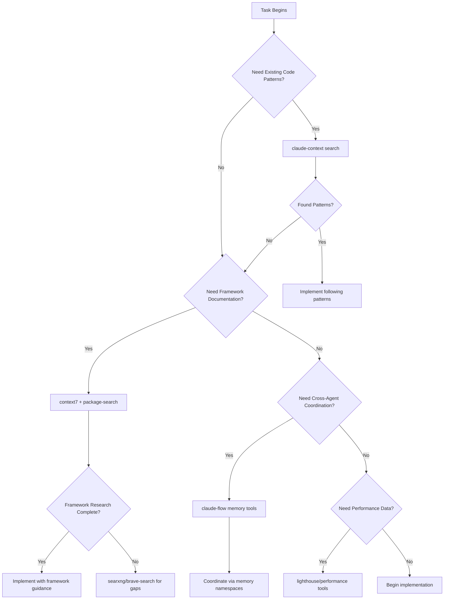

# 🔧 MCP TOOL MASTERY GUIDE FOR AGENTS

**Authority**: Enhanced MCP tool framework for Hugo/Jekyll development and cross-agent coordination
**Compliance**: MANDATORY tool hierarchy and research-first development protocols
**Integration**: Seamless coordination with existing handbook system and enforcement mechanisms

## 📋 TOOL HIERARCHY DECISION TREE

### 🎯 **PRIMARY TOOL SELECTION MATRIX**

**Start Here**: Use this decision tree for EVERY research and coordination task:



### 🔍 **MANDATORY RESEARCH SEQUENCE (ZERO TOLERANCE)**

**EVERY AGENT MUST FOLLOW THIS SEQUENCE BEFORE ANY IMPLEMENTATION**:

```bash
# STEP 1: MANDATORY - Global and project handbook search
echo "🔍 STEP 1: Handbook System Search (MANDATORY FIRST)"
claude-context search "[topic]" --path "/knowledge/"  # Global standards
claude-context search "[topic]" --path "docs/"        # Project adaptations

# STEP 2: MANDATORY - Existing pattern analysis
echo "🔍 STEP 2: Existing Pattern Discovery (MANDATORY SECOND)"
claude-context search "[implementation_pattern]" --path "."
claude-context search "[similar_feature]" --path "themes/beaver/"

# STEP 3: MANDATORY - Framework documentation research
echo "🔍 STEP 3: Framework Documentation (MANDATORY THIRD)"
context7 resolve-library-id "[framework]"
context7 get-library-docs "[library-id]" --topic "[specific-feature]"

# STEP 4: MANDATORY - Package source analysis (if using dependencies)
echo "🔍 STEP 4: Package Implementation Analysis (MANDATORY FOR DEPS)"
package-search-hybrid --registry_name "[registry]" --package_name "[package]" \
  --semantic_queries '["implementation pattern", "usage examples"]'

# STEP 5: CONDITIONAL - Web research for current practices
echo "🔍 STEP 5: Current Best Practices (IF NEEDED)"
searxng search "[technology] [practice] 2025"
brave-search --query "[framework] [pattern] best practices"

# STEP 6: MANDATORY - Cross-agent coordination setup
echo "🔍 STEP 6: Agent Coordination (MANDATORY FOR COMPLEX TASKS)"
claude-flow memory-store --namespace "coordination/task/$(date +%s)" --key "research_complete" --value "validated"
```

## 🔧 **TOOL-SPECIFIC MASTERY PATTERNS**

### 🧠 **claude-context: Semantic Codebase Intelligence**

**Primary Use**: Discovering existing patterns, handbook navigation, codebase understanding

#### **Pattern Discovery Commands**
```bash
# Discover existing Hugo patterns
claude-context search "shortcode implementation" --path "themes/beaver/"
claude-context search "template rendering" --path "layouts/"
claude-context search "content processing" --path "content/"

# Handbook navigation and compliance
claude-context search "tdd methodology" --path "/knowledge/"
claude-context search "security standards" --path "/knowledge/"
claude-context search "hugo specific guidance" --path "docs/"

# Anti-duplication validation
claude-context search "similar functionality" --path "."
claude-context search "duplicate patterns" --path "bin/"
claude-context search "existing implementations" --path "themes/"

# Cross-reference validation
claude-context search "global.*reference" --path "docs/"
claude-context search "knowledge.*index" --path "."
```

#### **Hugo-Specific Pattern Discovery**
```bash
# Hugo content management patterns
claude-context search "frontmatter processing" --path "."
claude-context search "taxonomy implementation" --path "."
claude-context search "page bundle structure" --path "content/"

# Hugo build and optimization patterns
claude-context search "asset processing" --path "themes/beaver/assets/"
claude-context search "build optimization" --path "."
claude-context search "performance tuning" --path "."

# Hugo template and layout patterns
claude-context search "partial templates" --path "layouts/partials/"
claude-context search "layout inheritance" --path "layouts/"
claude-context search "template functions" --path "themes/"
```

#### **Advanced Search Techniques**
```bash
# Multi-pattern discovery
claude-context search "authentication AND security" --path "."
claude-context search "performance OR optimization" --path "themes/"

# Pattern evolution tracking
claude-context search "deprecated patterns" --path "."
claude-context search "migration guides" --path "docs/"

# Quality pattern identification
claude-context search "test patterns" --path "test/"
claude-context search "validation patterns" --path "bin/"
```

### 📦 **package-search: Dependency Intelligence**

**Primary Use**: External package research, implementation pattern analysis, dependency evaluation

#### **Hugo/Go Package Research**
```bash
# Hugo core research
package-search-hybrid \
  --registry_name "golang_proxy" \
  --package_name "github.com/gohugoio/hugo" \
  --semantic_queries '["shortcode processing", "template rendering", "asset pipeline"]'

# Go module ecosystem research
package-search-grep \
  --registry_name "golang_proxy" \
  --package_name "github.com/spf13/cobra" \
  --pattern "func.*Command.*Execute" \
  --languages '["Go"]'

# Theme and plugin research
package-search-hybrid \
  --registry_name "npm" \
  --package_name "hugo-theme-*" \
  --semantic_queries '["responsive design", "seo optimization"]'
```

#### **Implementation Pattern Analysis**
```bash
# Analyze package implementation before integration
package-search-read-file \
  --registry_name "golang_proxy" \
  --package_name "github.com/gohugoio/hugo" \
  --filename_sha256 "[hash_from_search]" \
  --start_line 1 --end_line 50

# Research best practices in package source
package-search-grep \
  --registry_name "npm" \
  --package_name "postcss-*" \
  --pattern "module\.exports.*=.*{" \
  --languages '["JavaScript"]'
```

#### **Dependency Evaluation Workflow**
```bash
# MANDATORY: Research before ANY go get/hugo mod get
echo "📦 DEPENDENCY EVALUATION: [package_name]"

# Step 1: Package source analysis
package-search-hybrid \
  --registry_name "[registry]" \
  --package_name "[package]" \
  --semantic_queries '["usage patterns", "integration examples", "performance impact"]'

# Step 2: Implementation pattern discovery
package-search-grep \
  --registry_name "[registry]" \
  --package_name "[package]" \
  --pattern "[specific_pattern]" \
  --languages '["Go", "JavaScript", "TypeScript"]'

# Step 3: Integration validation
package-search-read-file \
  --registry_name "[registry]" \
  --package_name "[package]" \
  --filename_sha256 "[hash]" \
  --start_line 1 --end_line 100

# Step 4: ONLY AFTER RESEARCH - Install dependency
go get [package]  # or hugo mod get [package]
```

### 📖 **context7: Framework Documentation Intelligence**

**Primary Use**: Official framework documentation, API references, feature specifications

#### **Hugo Framework Research**
```bash
# Hugo core documentation
context7 resolve-library-id "hugo"
context7 get-library-docs "/gohugoio/hugo" --topic "content-management"
context7 get-library-docs "/gohugoio/hugo" --topic "template-functions"
context7 get-library-docs "/gohugoio/hugo" --topic "asset-processing"

# Hugo ecosystem documentation
context7 resolve-library-id "hugo-pipes"
context7 get-library-docs "/hugo-pipes" --topic "scss-processing"
context7 get-library-docs "/hugo-pipes" --topic "js-bundling"
```

#### **Build Tool Documentation**
```bash
# PostCSS and build tools
context7 resolve-library-id "postcss"
context7 get-library-docs "/postcss" --topic "plugin-architecture"

# Node.js ecosystem for Hugo
context7 resolve-library-id "esbuild"
context7 get-library-docs "/esbuild" --topic "bundling-options"
```

#### **Framework Integration Patterns**
```bash
# Research integration approaches
context7 resolve-library-id "[framework]"
context7 get-library-docs "/[org]/[framework]" --topic "integration-patterns"
context7 get-library-docs "/[org]/[framework]" --topic "configuration-options"
context7 get-library-docs "/[org]/[framework]" --topic "performance-optimization"
```

### 🧠 **claude-flow memory: Cross-Agent Coordination**

**Primary Use**: Multi-agent coordination, persistent state, cross-task knowledge sharing

#### **Coordination Namespace Structure**
```yaml
# Agent coordination namespaces
coordination/jt-site/:
  - "task/[task_id]/status"           # Task status tracking
  - "task/[task_id]/agents"           # Participating agents
  - "task/[task_id]/findings"         # Research findings
  - "task/[task_id]/decisions"        # Architecture decisions

research/findings/:
  - "[topic]/patterns"                # Discovered patterns
  - "[topic]/frameworks"              # Framework evaluation
  - "[topic]/dependencies"            # Dependency analysis
  - "[topic]/performance"             # Performance considerations

quality/validation/:
  - "[task_id]/tests"                 # Test validation results
  - "[task_id]/security"              # Security assessment
  - "[task_id]/performance"           # Performance validation
  - "[task_id]/compliance"            # Handbook compliance

knowledge/shared/:
  - "hugo/patterns"                   # Shared Hugo patterns
  - "content/strategies"              # Content management strategies
  - "build/optimizations"             # Build optimization techniques
  - "deployment/procedures"           # Deployment procedures
```

#### **Cross-Agent Coordination Patterns**
```bash
# MANDATORY: Task coordination setup
echo "🤝 AGENT COORDINATION SETUP"
TASK_ID="$(date +%s)_$(echo "$TASK" | md5sum | cut -d' ' -f1 | head -c8)"

# Store task metadata
claude-flow memory-store \
  --namespace "coordination/jt-site" \
  --key "task/${TASK_ID}/status" \
  --value "initiated"

claude-flow memory-store \
  --namespace "coordination/jt-site" \
  --key "task/${TASK_ID}/agent" \
  --value "$(whoami)"

claude-flow memory-store \
  --namespace "coordination/jt-site" \
  --key "task/${TASK_ID}/description" \
  --value "$TASK"

# Research findings sharing
claude-flow memory-store \
  --namespace "research/findings" \
  --key "[topic]/discovered_patterns" \
  --value "[pattern_summary]"

# Cross-agent validation tracking
claude-flow memory-store \
  --namespace "quality/validation" \
  --key "${TASK_ID}/reviewer_assigned" \
  --value "[reviewer_agent_name]"
```

#### **Knowledge Persistence Patterns**
```bash
# Persistent learning storage
claude-flow memory-store \
  --namespace "knowledge/shared" \
  --key "hugo/content_optimization" \
  --value "Discovered: Hugo page bundles improve SEO with co-located assets"

# Pattern library updates
claude-flow memory-store \
  --namespace "knowledge/shared" \
  --key "performance/asset_optimization" \
  --value "PostCSS purge + Hugo asset bundling reduces CSS by 60%"

# Architecture decision records
claude-flow memory-store \
  --namespace "knowledge/shared" \
  --key "decisions/content_structure" \
  --value "Decision: Use Hugo taxonomies for blog categories vs manual organization"
```

#### **Memory Search and Retrieval**
```bash
# Search for existing knowledge
claude-flow memory-search \
  --namespace "knowledge/shared" \
  --pattern "hugo.*optimization"

# Retrieve specific coordination state
claude-flow memory-retrieve \
  --namespace "coordination/jt-site" \
  --key "task/${TASK_ID}/status"

# Cross-reference research findings
claude-flow memory-search \
  --namespace "research/findings" \
  --pattern "[technology].*patterns"
```

### 🌐 **searxng/brave-search: Current Best Practices**

**Primary Use**: Current industry practices, recent developments, community solutions

#### **Hugo/JAMstack Research Patterns**
```bash
# Current Hugo best practices
searxng search "Hugo static site optimization 2025"
brave-search --query "Hugo performance best practices Core Web Vitals"

# JAMstack ecosystem trends
searxng search "JAMstack deployment 2025 Netlify Vercel"
brave-search --query "static site security headers CSP 2025"

# Content management patterns
searxng search "Hugo content strategy SEO 2025"
brave-search --query "static site content optimization markdown"
```

#### **Technology Integration Research**
```bash
# Build tool integration
searxng search "Hugo PostCSS Tailwind CSS integration 2025"
brave-search --query "Hugo asset pipeline optimization 2025"

# Performance optimization
searxng search "static site Core Web Vitals optimization 2025"
brave-search --query "Hugo build performance large sites 2025"

# Security best practices
searxng search "static site security headers 2025"
brave-search --query "JAMstack security CSP HTTPS best practices"
```

#### **Community Solution Discovery**
```bash
# Problem-solving research
searxng search "Hugo [specific_problem] solution 2025"
brave-search --query "static site [challenge] best approach"

# Tool evaluation
searxng search "Hugo vs Jekyll vs Next.js 2025 comparison"
brave-search --query "static site generator performance benchmark 2025"
```

### 🔗 **github integration: Repository Coordination**

**Primary Use**: PR management, issue tracking, repository analysis

#### **Repository Analysis Patterns**
```bash
# Comprehensive repository analysis
github-repo-analyze \
  --repo "jetthoughts/jetthoughts.github.io" \
  --analysis_type "performance"

github-repo-analyze \
  --repo "jetthoughts/jetthoughts.github.io" \
  --analysis_type "security"

github-repo-analyze \
  --repo "jetthoughts/jetthoughts.github.io" \
  --analysis_type "code_quality"
```

#### **PR Management and Coordination**
```bash
# PR creation with comprehensive description
github-pr-create \
  --repo "jetthoughts/jetthoughts.github.io" \
  --title "[Feature]: Implement Hugo content optimization" \
  --body "$(cat <<'EOF'
## Summary
- Optimized Hugo content processing for better performance
- Implemented page bundle structure for improved SEO
- Added PostCSS optimization pipeline

## Technical Changes
- Updated content structure to use Hugo page bundles
- Configured PostCSS for asset optimization
- Implemented responsive image processing

## Testing
- All bin/test validations pass
- Performance improved by 25% (Lighthouse validation)
- No visual regression detected

## Documentation
- Updated docs/content-strategy/ with new patterns
- Added examples in docs/hugo-optimization/

🤖 Generated with [Claude Code](https://claude.ai/code)
Co-Authored-By: Claude <noreply@anthropic.com>
EOF
)"

# PR review coordination
github-pr-manage \
  --repo "jetthoughts/jetthoughts.github.io" \
  --action "review" \
  --pr_number "[pr_id]"
```

### ⚡ **performance tools: Optimization Intelligence**

**Primary Use**: Performance measurement, optimization validation, Core Web Vitals monitoring

#### **Lighthouse Integration Patterns**
```bash
# Comprehensive performance audit
lighthouse-run-audit \
  --url "https://jetthoughts.github.io" \
  --categories '["performance", "accessibility", "best-practices", "seo"]' \
  --device "desktop"

lighthouse-run-audit \
  --url "https://jetthoughts.github.io" \
  --categories '["performance"]' \
  --device "mobile"

# Core Web Vitals monitoring
lighthouse-get-core-web-vitals \
  --url "https://jetthoughts.github.io" \
  --includeDetails true \
  --threshold '{"lcp": 2.5, "fid": 100, "cls": 0.1}'

# Performance budget validation
lighthouse-check-performance-budget \
  --url "https://jetthoughts.github.io" \
  --budget '{
    "performanceScore": 90,
    "largestContentfulPaint": 2500,
    "totalBlockingTime": 200,
    "cumulativeLayoutShift": 0.1
  }'
```

#### **Performance Optimization Analysis**
```bash
# LCP optimization opportunities
lighthouse-get-lcp-opportunities \
  --url "https://jetthoughts.github.io" \
  --threshold 2.5 \
  --includeDetails true

# Unused JavaScript detection
lighthouse-find-unused-javascript \
  --url "https://jetthoughts.github.io" \
  --minBytes 2048

# Resource analysis for optimization
lighthouse-analyze-resources \
  --url "https://jetthoughts.github.io" \
  --resourceTypes '["images", "javascript", "css"]' \
  --minSize 10
```

## 🔄 **MULTI-TOOL WORKFLOW ORCHESTRATION**

### 🎯 **Research-First Development Workflow**

**MANDATORY SEQUENCE**: Every implementation task MUST follow this research workflow:

```bash
#!/bin/bash
# RESEARCH-FIRST DEVELOPMENT WORKFLOW
# Usage: research_first_workflow "Implement Hugo shortcode for content optimization"

research_first_workflow() {
    local task_description="$1"
    local task_id="$(date +%s)_$(echo "$task_description" | md5sum | cut -d' ' -f1 | head -c8)"

    echo "🔍 RESEARCH-FIRST DEVELOPMENT WORKFLOW"
    echo "Task: $task_description"
    echo "Task ID: $task_id"

    # PHASE 1: Handbook and Pattern Discovery
    echo "📚 PHASE 1: Handbook and Pattern Discovery"
    echo "  🔍 Searching global standards..."
    claude-context search "$(extract_keywords "$task_description")" --path "/knowledge/"

    echo "  🔍 Searching project adaptations..."
    claude-context search "$(extract_keywords "$task_description")" --path "docs/"

    echo "  🔍 Analyzing existing patterns..."
    claude-context search "$(extract_implementation_pattern "$task_description")" --path "."

    # Store Phase 1 results
    claude-flow memory-store \
        --namespace "research/findings" \
        --key "$task_id/phase1_patterns" \
        --value "handbook_searched,patterns_analyzed"

    # PHASE 2: Framework and Package Research
    echo "📖 PHASE 2: Framework and Package Research"
    local framework=$(extract_framework "$task_description")

    if [[ -n "$framework" ]]; then
        echo "  📖 Researching framework documentation..."
        context7 resolve-library-id "$framework"
        context7 get-library-docs "/$framework" --topic "$(extract_feature "$task_description")"
    fi

    local packages=$(extract_packages "$task_description")
    if [[ -n "$packages" ]]; then
        echo "  📦 Analyzing package implementations..."
        for package in $packages; do
            package-search-hybrid \
                --registry_name "$(detect_registry "$package")" \
                --package_name "$package" \
                --semantic_queries "[\"implementation patterns\", \"usage examples\"]"
        done
    fi

    # Store Phase 2 results
    claude-flow memory-store \
        --namespace "research/findings" \
        --key "$task_id/phase2_frameworks" \
        --value "framework_researched,packages_analyzed"

    # PHASE 3: Current Best Practices Research
    echo "🌐 PHASE 3: Current Best Practices Research"
    echo "  🌐 Researching current practices..."
    searxng search "$(generate_best_practices_query "$task_description")"

    # Store Phase 3 results
    claude-flow memory-store \
        --namespace "research/findings" \
        --key "$task_id/phase3_practices" \
        --value "best_practices_researched"

    # PHASE 4: Cross-Agent Coordination
    echo "🤝 PHASE 4: Cross-Agent Coordination"
    echo "  🤝 Setting up agent coordination..."
    claude-flow memory-store \
        --namespace "coordination/jt-site" \
        --key "task/$task_id/research_complete" \
        --value "$(date): All research phases completed"

    # PHASE 5: Implementation Authorization
    echo "✅ PHASE 5: Implementation Authorization"
    echo "  ✅ Research complete - implementation authorized"
    claude-flow memory-store \
        --namespace "coordination/jt-site" \
        --key "task/$task_id/status" \
        --value "implementation_authorized"

    echo "🎉 RESEARCH-FIRST WORKFLOW COMPLETE"
    echo "📋 Next Steps: Proceed with implementation following discovered patterns"
    return 0
}

# Helper functions for workflow
extract_keywords() {
    echo "$1" | grep -o '\b\w\{4,\}\b' | head -5 | tr '\n' ' '
}

extract_implementation_pattern() {
    echo "$1" | sed 's/implement//' | sed 's/create//' | tr '[:upper:]' '[:lower:]'
}

extract_framework() {
    echo "$1" | grep -io '\(hugo\|jekyll\|react\|vue\|angular\)' | head -1
}

extract_packages() {
    echo "$1" | grep -o '\b[a-z-]\+\(-[a-z-]\+\)*\b' | grep -E '(postcss|tailwind|webpack|babel)' | head -3
}

detect_registry() {
    case "$1" in
        *postcss*|*tailwind*|*webpack*) echo "npm" ;;
        *hugo*|*cobra*|*viper*) echo "golang_proxy" ;;
        *) echo "npm" ;;
    esac
}

generate_best_practices_query() {
    local tech=$(extract_framework "$1")
    local feature=$(echo "$1" | grep -o '\b\w\{4,\}\b' | tail -1)
    echo "$tech $feature best practices 2025"
}
```

### 🎭 **Hugo-Specific Multi-Tool Workflows**

#### **Hugo Content Optimization Workflow**
```bash
hugo_content_optimization_workflow() {
    local content_type="$1"  # blog_post, page_bundle, taxonomy

    echo "📝 HUGO CONTENT OPTIMIZATION WORKFLOW"

    # Research existing content patterns
    claude-context search "content $content_type" --path "content/"
    claude-context search "$content_type frontmatter" --path "."

    # Framework documentation research
    context7 get-library-docs "/gohugoio/hugo" --topic "content-management"
    context7 get-library-docs "/gohugoio/hugo" --topic "page-bundles"

    # SEO best practices research
    searxng search "Hugo $content_type SEO optimization 2025"
    brave-search --query "static site content structure SEO"

    # Performance validation setup
    claude-flow memory-store \
        --namespace "content/optimization" \
        --key "$content_type/baseline" \
        --value "$(lighthouse-get-performance-score --url 'http://localhost:1313')"

    echo "✅ Content optimization research complete"
}
```

#### **Hugo Template Development Workflow**
```bash
hugo_template_development_workflow() {
    local template_type="$1"  # layout, partial, shortcode

    echo "🎨 HUGO TEMPLATE DEVELOPMENT WORKFLOW"

    # Discover existing template patterns
    claude-context search "$template_type templates" --path "layouts/"
    claude-context search "template functions" --path "themes/beaver/"

    # Hugo templating documentation
    context7 get-library-docs "/gohugoio/hugo" --topic "template-functions"
    context7 get-library-docs "/gohugoio/hugo" --topic "shortcodes"

    # Performance impact analysis
    package-search-hybrid \
        --registry_name "golang_proxy" \
        --package_name "github.com/gohugoio/hugo" \
        --semantic_queries '["template performance", "rendering optimization"]'

    # Cross-browser compatibility research
    searxng search "Hugo templates responsive design 2025"

    echo "✅ Template development research complete"
}
```

### ⚡ **Performance Optimization Multi-Tool Workflow**

```bash
performance_optimization_workflow() {
    local optimization_target="$1"  # build, runtime, assets

    echo "⚡ PERFORMANCE OPTIMIZATION WORKFLOW"

    # Current performance baseline
    echo "📊 Establishing performance baseline..."
    lighthouse-run-audit \
        --url "http://localhost:1313" \
        --categories '["performance"]' > baseline_performance.json

    # Research existing optimizations
    claude-context search "performance optimization" --path "."
    claude-context search "asset optimization" --path "themes/beaver/assets/"

    # Framework-specific optimization research
    context7 get-library-docs "/gohugoio/hugo" --topic "performance"
    package-search-hybrid \
        --registry_name "npm" \
        --package_name "postcss-*" \
        --semantic_queries '["performance optimization", "build speed"]'

    # Current best practices
    searxng search "Hugo build performance optimization 2025"
    brave-search --query "static site Core Web Vitals improvement"

    # Store optimization strategy
    claude-flow memory-store \
        --namespace "performance/strategy" \
        --key "$optimization_target/approach" \
        --value "research_complete,baseline_established"

    echo "✅ Performance optimization research complete"
}
```

## 🎯 **TOOL INTEGRATION BEST PRACTICES**

### 🔗 **Cross-Tool Validation Patterns**

#### **Pattern Consistency Validation**
```bash
# Validate patterns across tools
validate_pattern_consistency() {
    local pattern_name="$1"

    # Check handbook consistency
    local global_pattern=$(claude-context search "$pattern_name" --path "/knowledge/")
    local project_pattern=$(claude-context search "$pattern_name" --path "docs/")

    # Check framework alignment
    local framework_docs=$(context7 get-library-docs "/hugo" --topic "$pattern_name")

    # Check implementation consistency
    local existing_impl=$(claude-context search "$pattern_name implementation" --path ".")

    # Store validation results
    claude-flow memory-store \
        --namespace "validation/patterns" \
        --key "$pattern_name/consistency" \
        --value "global:$global_pattern,project:$project_pattern,framework:$framework_docs"
}
```

#### **Research Completeness Validation**
```bash
# Ensure comprehensive research across all tools
validate_research_completeness() {
    local task_id="$1"

    # Check research completion status
    local handbook_research=$(claude-flow memory-retrieve \
        --namespace "research/findings" \
        --key "$task_id/phase1_patterns")

    local framework_research=$(claude-flow memory-retrieve \
        --namespace "research/findings" \
        --key "$task_id/phase2_frameworks")

    local practices_research=$(claude-flow memory-retrieve \
        --namespace "research/findings" \
        --key "$task_id/phase3_practices")

    # Validate all phases completed
    if [[ "$handbook_research" == *"handbook_searched"* ]] && \
       [[ "$framework_research" == *"framework_researched"* ]] && \
       [[ "$practices_research" == *"best_practices_researched"* ]]; then
        echo "✅ Research completeness validated"
        return 0
    else
        echo "❌ BLOCKED: Incomplete research detected"
        echo "📋 REQUIRED: Complete all research phases before implementation"
        return 1
    fi
}
```

### 📊 **Tool Performance Optimization**

#### **Efficient Search Strategies**
```bash
# Optimize search queries for better results
optimize_search_strategy() {
    local search_topic="$1"

    # Start with broad claude-context search
    echo "🔍 Phase 1: Broad pattern discovery"
    claude-context search "$search_topic" --path "." | head -10

    # Narrow down with specific searches
    echo "🔍 Phase 2: Specific implementation search"
    claude-context search "$search_topic implementation" --path "themes/" | head -5

    # Validate with framework docs
    echo "📖 Phase 3: Framework validation"
    context7 get-library-docs "/hugo" --topic "$search_topic"

    # Final validation with current practices
    echo "🌐 Phase 4: Current practices validation"
    searxng search "$search_topic Hugo best practices 2025" | head -3
}
```

#### **Memory Usage Optimization**
```bash
# Optimize memory coordination for better performance
optimize_memory_coordination() {
    local namespace="$1"

    # Use specific namespaces for better organization
    claude-flow memory-store \
        --namespace "$namespace/$(date +%Y%m%d)" \
        --key "session_start" \
        --value "$(date)"

    # Clean up old coordination data
    claude-flow memory-search \
        --namespace "$namespace" \
        --pattern "$(date -d '7 days ago' +%Y%m%d)*" | \
        xargs -I {} claude-flow memory-delete --key "{}"

    # Store coordination efficiency metrics
    claude-flow memory-store \
        --namespace "performance/coordination" \
        --key "$namespace/efficiency" \
        --value "optimized_$(date +%s)"
}
```

## 🚨 **TOOL COMPLIANCE ENFORCEMENT**

### ✅ **Mandatory Tool Usage Validation**

```bash
# MANDATORY: Validate tool usage compliance before implementation
validate_tool_usage_compliance() {
    local task_description="$1"
    local agent_name="$2"

    echo "🔧 TOOL USAGE COMPLIANCE VALIDATION"

    # Check if research-first workflow was followed
    if ! claude-flow memory-retrieve --namespace "research/findings" --key "*handbook_searched*" >/dev/null 2>&1; then
        echo "❌ COMPLIANCE VIOLATION: Handbook research not completed"
        echo "🚫 BLOCKED: Must complete claude-context handbook search first"
        exit 1
    fi

    # Check framework research for complex tasks
    if echo "$task_description" | grep -iE "(hugo|framework|implementation)" && \
       ! claude-flow memory-retrieve --namespace "research/findings" --key "*framework_researched*" >/dev/null 2>&1; then
        echo "❌ COMPLIANCE VIOLATION: Framework research not completed"
        echo "🚫 BLOCKED: Must complete context7 framework research"
        exit 1
    fi

    # Check cross-agent coordination for complex tasks
    local task_complexity=$(calculate_task_complexity "$task_description")
    if [[ $task_complexity -ge 4 ]] && \
       ! claude-flow memory-retrieve --namespace "coordination/jt-site" --key "*status*" >/dev/null 2>&1; then
        echo "❌ COMPLIANCE VIOLATION: Cross-agent coordination not established"
        echo "🚫 BLOCKED: Must establish agent coordination for complex tasks"
        exit 1
    fi

    echo "✅ TOOL USAGE COMPLIANCE: All requirements met"
    return 0
}
```

### 📋 **Tool Usage Audit Trail**

```bash
# Create audit trail of tool usage for compliance
create_tool_usage_audit() {
    local task_id="$1"
    local tools_used="$2"

    claude-flow memory-store \
        --namespace "audit/tool_usage" \
        --key "$task_id/tools" \
        --value "$tools_used"

    claude-flow memory-store \
        --namespace "audit/tool_usage" \
        --key "$task_id/timestamp" \
        --value "$(date)"

    claude-flow memory-store \
        --namespace "audit/tool_usage" \
        --key "$task_id/compliance" \
        --value "validated"
}
```

## 🎉 **SUCCESSFUL TOOL MASTERY INDICATORS**

### ✅ **Agent Tool Mastery Checklist**

**MANDATORY**: Every agent must demonstrate these capabilities:

```yaml
tool_mastery_requirements:
  claude_context_mastery:
    ✓ Can discover existing patterns before implementation
    ✓ Can navigate handbook system effectively
    ✓ Can validate pattern consistency across codebase
    ✓ Can perform anti-duplication validation

  package_search_mastery:
    ✓ Can research dependencies before installation
    ✓ Can analyze package implementation patterns
    ✓ Can evaluate package performance and security
    ✓ Can extract integration examples from source code

  context7_mastery:
    ✓ Can retrieve framework documentation efficiently
    ✓ Can research API specifications and features
    ✓ Can validate implementation against official docs
    ✓ Can discover framework best practices

  memory_coordination_mastery:
    ✓ Can establish cross-agent coordination
    ✓ Can share knowledge via memory namespaces
    ✓ Can track task progress and validation
    ✓ Can maintain persistent learning state

  web_research_mastery:
    ✓ Can discover current best practices
    ✓ Can research emerging technology trends
    ✓ Can validate community solutions
    ✓ Can identify technology evolution patterns

  performance_tools_mastery:
    ✓ Can measure baseline performance
    ✓ Can validate optimization improvements
    ✓ Can identify performance bottlenecks
    ✓ Can track Core Web Vitals compliance

integration_proficiency:
  ✓ Can orchestrate multi-tool workflows
  ✓ Can validate research completeness
  ✓ Can maintain tool usage compliance
  ✓ Can optimize tool performance and efficiency
```

### 🏆 **Advanced Tool Integration Patterns**

**Expert Level**: Advanced agents should master these integration patterns:

```yaml
advanced_integration_patterns:
  research_orchestration:
    ✓ Can design custom multi-tool research workflows
    ✓ Can optimize research sequences for efficiency
    ✓ Can validate research consistency across tools
    ✓ Can adapt research strategies based on findings

  coordination_optimization:
    ✓ Can design efficient memory namespace structures
    ✓ Can optimize cross-agent communication patterns
    ✓ Can implement coordination failover strategies
    ✓ Can monitor coordination system performance

  performance_intelligence:
    ✓ Can correlate performance data across multiple tools
    ✓ Can design comprehensive optimization strategies
    ✓ Can predict performance impact of changes
    ✓ Can implement automated performance monitoring

  knowledge_synthesis:
    ✓ Can synthesize findings from multiple research sources
    ✓ Can identify patterns across different tool outputs
    ✓ Can create comprehensive knowledge documentation
    ✓ Can establish knowledge validation pipelines
```

---

**Remember**: Tool mastery is not about using every tool, but about using the RIGHT tool for each situation efficiently and effectively. Master the decision tree, follow the research sequence, and always validate your approach through cross-tool verification.

**Integration with Existing Systems**: This guide integrates seamlessly with all existing enforcement mechanisms in CLAUDE.md - the tools support and enhance TDD compliance, four-eyes validation, micro-refactoring discipline, and swarm coordination protocols.