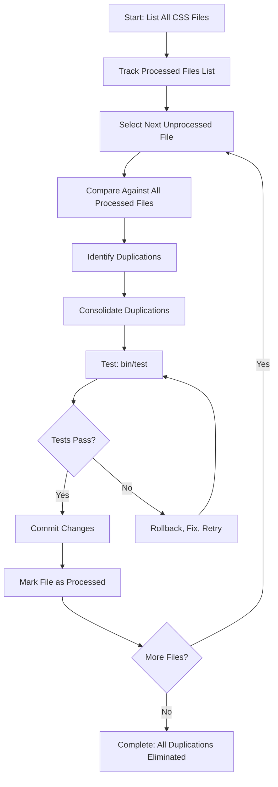

# Sequential File-by-File CSS Consolidation Strategy

**Date**: 2025-01-27
**Status**: Active Strategy - Approved for Execution
**Strategy Type**: Sequential Processing with Pairwise Consolidation
**Execution Mode**: Swarm (claude-flow) with Queen (Hive Mind)

---

## 🎯 STRATEGY OVERVIEW

**Core Approach**: Process CSS files one-by-one in sequence. For each new file, identify duplications with all previously processed files, consolidate them, then move to the next file.

**Key Principle**: By end of processing all files, all duplications will have been eliminated through systematic pairwise comparison.

---

## 🔄 SEQUENTIAL PROCESSING WORKFLOW

### Step-by-Step Process



### Detailed Workflow

#### **Phase 1: Initialize**
```bash
# 1. List all CSS files in scope
find themes/beaver/assets/css -name "*.css" -type f > _runtime/css-files-list.txt

# 2. Create tracking files
touch _runtime/processed-files.txt
touch _runtime/consolidation-log.md
```

#### **Phase 2: Process Each File**

**For each file in CSS files list**:

1. **Load File**: Read current unprocessed file
2. **Compare**: Search for duplications in all processed files
   ```bash
   # Use grep for pattern search
   grep -n "pattern" processed-file-1.css
   grep -n "pattern" processed-file-2.css

   # Use claude-context for semantic search
   claude-context search "css-pattern" --path "themes/beaver/assets/css"
   ```

3. **Identify Duplications**:
   - Exact CSS rule matches
   - Similar patterns with minor variations
   - Common utility patterns (margin:0, padding:0, etc.)
   - Repeated selectors with same properties
   - Media query duplications

4. **Consolidate**:
   - Extract to foundation file OR
   - Reference existing foundation pattern OR
   - Create utility class

5. **Test**:
   ```bash
   bin/test  # Full test suite (system + unit)
   # If timeout, tests are running (working fine)
   ```

6. **Commit**:
   ```bash
   git add [modified-files]
   git commit -m "refactor(css): consolidate [pattern] from [file]"
   ```

7. **Track Progress**:
   ```bash
   echo "[current-file]" >> _runtime/processed-files.txt
   echo "## File: [current-file]" >> _runtime/consolidation-log.md
   echo "- Duplications found: X" >> _runtime/consolidation-log.md
   echo "- Lines eliminated: Y" >> _runtime/consolidation-log.md
   ```

#### **Phase 3: Complete**
- All files processed
- All pairwise duplications eliminated
- Final validation run
- Generate completion report

---

## 📊 TRACKING & METRICS

### Files to Track
```yaml
tracking_files:
  input: "_runtime/css-files-list.txt"          # All CSS files in scope
  processed: "_runtime/processed-files.txt"      # Files already processed
  log: "_runtime/consolidation-log.md"          # Detailed consolidation log
  metrics: "_runtime/consolidation-metrics.json" # Real-time metrics
```

### Metrics to Capture

**Per File**:
- Duplications found
- Lines eliminated
- Foundation files created/referenced
- Test results (pass/fail)
- Commit hash

**Cumulative**:
- Total files processed
- Total duplications eliminated
- Total lines eliminated
- Total commits made
- Current duplication rate

---

## 🐝 SWARM AGENT ROLES

### **Queen (Coordinator)**
- Initialize file list and tracking
- Select next unprocessed file
- Aggregate results from worker agents
- Generate progress reports
- Decision-making when conflicts arise

### **Researcher Agent**
- Compare current file against all processed files
- Use grep + claude-context for duplication detection
- Identify exact matches and similar patterns
- Document findings in structured format
- Pass findings to coder agent

### **Coder Agent**
- Implement consolidation based on researcher findings
- Extract to foundation files
- Update file references
- Maintain micro-commit discipline (≤3 lines)
- Test after EACH change

### **Analyst Agent**
- Track metrics per file and cumulative
- Update tracking files (_runtime/*.txt, *.md)
- Generate progress reports
- Validate against goal targets
- Alert on anomalies

### **Tester Agent**
- Run bin/test after each coder change
- Validate zero visual regressions (≤3% tolerance)
- Performance validation (Lighthouse, FCP)
- BLOCKING AUTHORITY if tests fail
- Document test results

---

## 🛠️ TOOLS & COMMANDS

### Search Tools (Both Allowed)

**grep** (pattern-based):
```bash
# Find exact pattern
grep -rn "margin: 0" themes/beaver/assets/css/

# Find with context
grep -A5 -B5 "pattern" file.css

# Count occurrences
grep -c "pattern" file.css
```

**claude-context** (semantic):
```bash
# Semantic search
claude-context search "responsive breakpoint patterns" \
  --path "themes/beaver/assets/css"

# Targeted search
claude-context search "fl-row layout" \
  --path "themes/beaver/assets/css" \
  --limit 50
```

### Testing Commands
```bash
# Full test suite (system + unit)
bin/test

# Quick validation (if bin/test times out)
bin/rake test:critical
```

---

## 📋 DECISION RULES

### When to Extract to Foundation File
- Pattern appears in 3+ files
- Pattern is semantically cohesive (e.g., FL-row layout)
- Pattern has clear reusability

### When to Create Utility Class
- Pattern is atomic (e.g., margin:0, padding:0)
- Pattern is frequently repeated
- Pattern has no dependencies

### When to Reference Existing Foundation
- Pattern already exists in foundation file
- Pattern matches existing utility class
- No need for new extraction

### When to Skip Consolidation
- Pattern is page-specific (.fl-node-* overrides)
- Pattern is intentional duplication (404.css, 3114-layout.css - no critical CSS infrastructure)
- Consolidation would break functionality

---

## 🎯 SUCCESS CRITERIA

**Per File Processing**:
- ✅ All duplications with processed files identified
- ✅ Consolidations implemented and tested
- ✅ Zero test failures
- ✅ Zero visual regressions
- ✅ Micro-commits completed

**Overall Goal**:
- ✅ All CSS files processed
- ✅ 70-80% duplication eliminated (27,094-31,536 lines)
- ✅ 5-7 foundation files created
- ✅ 100% test pass rate maintained
- ✅ Zero visual regressions throughout

---

## 🚨 CONSTRAINTS & SAFEGUARDS

### MANDATORY After Each Change
```bash
bin/test  # OR bin/rake test:critical if timeout
# MUST show: Tests passing (or running to completion)
```

### Visual Regression Tolerance
- **0%** for refactoring (this is refactoring work)
- **≤3%** for new features (not applicable here)

### Micro-Commit Discipline
- ≤3 lines per commit
- Test after EACH commit
- Rollback immediately on failure

### Blocking Conditions
- ANY test failure → STOP, rollback, investigate
- Visual regression >0% → STOP, preserve CSS
- Performance regression → STOP, validate changes

### Page-Specific Preservation (CRITICAL)
- **404.css**: BLOCKED (no critical CSS infrastructure)
- **3114-layout.css**: BLOCKED (blog pages - no critical CSS)
- **.fl-node-* selectors**: PRESERVE (page-specific overrides)
- **Layout-critical CSS**: DO NOT consolidate

---

## 📈 EXAMPLE FILE PROCESSING

### Example: Processing `homepage-layout.css`

**Step 1: Compare Against Processed Files**
```bash
# Assume already processed: base-critical.css, about-us-critical.css

# Search for duplications
grep -rn "margin: 0" base-critical.css about-us-critical.css
grep -rn "padding: 0" base-critical.css about-us-critical.css
grep -rn "font-family: system-ui" base-critical.css about-us-critical.css
```

**Step 2: Identify Duplications**
```yaml
duplications_found:
  - pattern: "margin: 0"
    occurrences: 5 in homepage, 3 in base-critical, 2 in about-us
    consolidation: Create utility .u-margin-0

  - pattern: "font-family: system-ui"
    occurrences: 2 in homepage, 1 in base-critical, 1 in about-us
    consolidation: Use existing var(--font-system-ui)
```

**Step 3: Consolidate**
```bash
# Create utility (if doesn't exist)
# File: themes/beaver/assets/css/foundations/_reset-utilities.scss
.u-margin-0 { margin: 0; }

# Update homepage-layout.css
# Replace: margin: 0;
# With: @apply .u-margin-0; (or direct class usage)

# Update font references
# Replace: font-family: system-ui, ...;
# With: font-family: var(--font-system-ui);
```

**Step 4: Test**
```bash
bin/test
# Verify: Tests pass or running
```

**Step 5: Commit**
```bash
git add homepage-layout.css foundations/_reset-utilities.scss
git commit -m "refactor(css): consolidate margin:0 pattern in homepage-layout"
```

**Step 6: Track**
```bash
echo "homepage-layout.css" >> _runtime/processed-files.txt
echo "## homepage-layout.css" >> _runtime/consolidation-log.md
echo "- margin:0 pattern: 5 occurrences → utility class" >> _runtime/consolidation-log.md
echo "- font-family: 2 occurrences → CSS variable" >> _runtime/consolidation-log.md
echo "- Lines eliminated: 7" >> _runtime/consolidation-log.md
```

---

## 🎊 COMPLETION CRITERIA

**Strategy Complete When**:
- ✅ All CSS files in _runtime/css-files-list.txt processed
- ✅ All pairwise duplications eliminated
- ✅ Final duplication rate <5% (PostCSS validation)
- ✅ 27,094-31,536 lines eliminated (70-80% reduction)
- ✅ All tests passing
- ✅ Zero visual regressions
- ✅ Consolidation log complete
- ✅ Final metrics report generated

**Deliverables**:
1. ✅ 5-7 foundation CSS files
2. ✅ Updated CSS file references
3. ✅ Consolidation log with full history
4. ✅ Metrics report with before/after comparison
5. ✅ Test validation report
6. ✅ Visual regression report

---

## 🚀 SWARM EXECUTION HANDOFF

**Ready for Swarm Execution**: YES ✅

**Swarm Configuration**:
- **Queen**: Strategic coordinator (hive-mind)
- **Researcher**: Duplication detection (grep + claude-context)
- **Coder**: Consolidation implementation (micro-commits)
- **Analyst**: Metrics tracking (real-time progress)
- **Tester**: Quality validation (blocking authority)

**Starting Point**:
```bash
# Generate file list
find themes/beaver/assets/css -name "*.css" -type f > _runtime/css-files-list.txt

# Initialize tracking
touch _runtime/processed-files.txt
touch _runtime/consolidation-log.md

# Begin processing first file
# (Swarm will handle sequentially)
```

**Memory Coordination**:
- hive/queen/file-selection/
- hive/researcher/duplications/
- hive/coder/consolidations/
- hive/analyst/metrics/
- hive/tester/validation/

---

**Last Updated**: 2025-01-27
**Strategy Owner**: CSS Migration Project Team
**Execution Mode**: Swarm (claude-flow) + Queen (Hive Mind)

**Navigation**:
- 🏠 [Project Index](../PROJECT-INDEX.md)
- 🎯 [Original Goal](35.04-revised-goal-css-duplication-elimination.md)
- 📊 [Task Tracker](../TASK-TRACKER.md)
