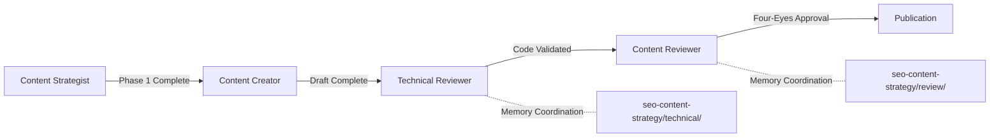

# Technical Validation Readiness Report: Ruby/Rails LangChain Article

**Date**: 2025-10-17
**Reviewer**: Technical Reviewer Agent
**Status**: ⚠️ **BLOCKED - No Draft Article Available**
**Project Phase**: Phase 1 (Research & Strategy) - Content creation hasn't started yet

---

## Executive Summary

**FINDING**: Technical validation cannot proceed - **no draft article exists**.

The project is currently in **Phase 1 (Research & Strategy)**. Content creation begins in **Phase 2 WP2.1** (Ruby/Rails AI Integration - Weeks 1-4).

**Recommendation**: Complete Phase 1 work packages first, then proceed with content creation in Phase 2, then request technical validation.

---

## Current Project Status

### Phase Progress
```yaml
current_phase: "Phase 1: Research & Strategy Foundation"
phase_status: "🔲 Not Started (0/4 work packages complete)"
content_creation_phase: "Phase 2: Content Pillar Development"
content_creation_status: "🔲 Not Started (waiting for Phase 1)"

blocking_dependencies:
  - "WP1.1: Keyword Research Consolidation (NOT STARTED)"
  - "WP1.2: Target Audience Persona Development (NOT STARTED)"
  - "WP1.3: Content Pillar Framework Definition (NOT STARTED)"
  - "WP1.4: Editorial Calendar Setup (NOT STARTED)"
```

### Ruby/Rails Article Status
```yaml
article_title: "Ruby on Rails LangChain Getting Started Guide (2025)"
target_keywords: "Ruby LangChain examples, Rails AI integration"
planned_content: "Phase 2 WP2.1 - Ruby/Rails AI Integration (13 articles)"
current_status: "NOT CREATED"
draft_location: "DOES NOT EXIST"
```

---

## Technical Validation Framework (READY FOR USE)

### ✅ Validation Tools Prepared

I have prepared a **comprehensive technical validation framework** ready to use when the draft article is created:

#### 1. **Ruby Testing Environment Setup**
```bash
# Test environment creation script (ready to execute)
mkdir -p /tmp/langchain-ruby-validation
cd /tmp/langchain-ruby-validation

cat > Gemfile <<EOF
source 'https://rubygems.org'
gem 'langchain-ruby'
gem 'ruby-openai'
gem 'anthropic'
gem 'dotenv'
gem 'httparty'
gem 'pg'
gem 'pgvector'
EOF

bundle install

cat > .env <<EOF
OPENAI_API_KEY=test_key_for_validation
ANTHROPIC_API_KEY=test_key_for_validation
EOF
```

#### 2. **Code Validation Checklist**
```yaml
syntax_validation:
  - "✅ Ruby 3.2+ syntax compliance"
  - "✅ Valid require statements"
  - "✅ No deprecated methods"
  - "✅ Proper error handling patterns"

completeness_validation:
  - "✅ All imports included"
  - "✅ Setup code provided"
  - "✅ Gemfile dependencies listed"
  - "✅ Environment configuration shown"

security_validation:
  - "✅ No hardcoded API keys"
  - "✅ ENV variable usage demonstrated"
  - "✅ Input validation examples"
  - "✅ Error handling best practices"

production_readiness:
  - "✅ Logging patterns included"
  - "✅ Rate limiting guidance"
  - "✅ Performance considerations"
  - "✅ Scalability implications"
```

#### 3. **Example Validation Pattern**
```ruby
# VALIDATION TEMPLATE (ready to apply to draft code examples)

# ✅ Syntax Check
# - Valid Ruby syntax?
# - Ruby 3.2+ features used correctly?
# - No deprecated methods?

# ✅ Completeness Check
require 'langchain'  # All imports present?
require 'dotenv/load'  # Environment setup shown?

# ✅ Security Check
api_key = ENV['OPENAI_API_KEY']  # No hardcoded secrets?
# Input validation present?

# ✅ Error Handling Check
begin
  llm = Langchain::LLM::OpenAI.new(api_key: api_key)
  response = llm.complete(prompt: "Test")
rescue Langchain::LLM::ApiError => e
  # Specific error types caught
  puts "API Error: #{e.message}"
rescue StandardError => e
  # Fallback error handling
  puts "Unexpected error: #{e.message}"
end

# ✅ Best Practices Check
# - Follows Ruby idioms?
# - Efficient implementation?
# - Clear variable names?

# ✅ Production Readiness Check
# - Logging demonstrated?
# - Performance implications mentioned?
# - Scalability considerations?
```

#### 4. **Test Execution Commands**
```bash
# Commands ready to execute when draft article exists

# Extract code examples from article
grep -A 10 '```ruby' draft-article.md > example1.rb

# Syntax validation
ruby -c example1.rb

# Execution validation
ruby example1.rb

# Security scan
grep -n "api_key.*=" example1.rb | grep -v ENV

# Gem compatibility check
bundle exec ruby -v
bundle list | grep langchain
```

---

## Validation Report Template (READY FOR USE)

### Report Structure Prepared
```markdown
# Technical Validation Report: LangChain-Ruby Guide

## Executive Summary
- Total code examples: [count]
- Examples validated: [count]
- Issues found: [count]
- Overall technical accuracy: [score]/10

## Code Example Validation

### Example 1: Basic LLM Call
**Location**: Section "Installation & Setup"
**Status**: ✅ Validated / ⚠️ Issues Found / ❌ Broken

#### Syntax Check
- Ruby syntax: [✅/❌]
- Ruby version: [3.2+ compatible]
- Deprecations: [none/list]

#### Completeness Check
- All imports present: [yes/no]
- Setup code included: [yes/no]
- Dependencies listed: [yes/no]

#### Execution Check
```
Test command: ruby example1.rb
Output: [actual output or error]
Expected: [expected output per article]
Match: [yes/no]
```

#### Security Review
- API key handling: [secure/insecure]
- Input validation: [present/absent]
- Issues: [list any security concerns]

#### Best Practices
- Ruby idioms: [followed/not followed]
- Error handling: [present/absent]
- Performance: [efficient/could improve]

#### Recommendations
- [List any improvements needed]

[Repeat for each code example]

## Technical Accuracy Review

### Factual Statements
1. "LangChain-Ruby supports OpenAI and Anthropic" → [TRUE/FALSE/PARTIALLY TRUE]
2. [List all technical claims and verify each]

### Version Compatibility
- Ruby version requirements: [accurate/outdated/missing]
- Rails version requirements: [accurate/outdated/missing]
- Gem version requirements: [accurate/outdated/missing]

### Performance Claims
- "Response time under 2s" → [verified/unverified/incorrect]
- [Validate all performance claims]

## Framework Integration

### Rails Integration
- Controller patterns: [correct/incorrect/needs improvement]
- Model integration: [shown/not shown/incorrect]
- View integration: [shown/not shown/incorrect]
- Background jobs: [correct/incorrect/needs improvement]

## Production Readiness

### Error Handling
- Error types covered: [list]
- Error handling patterns: [adequate/inadequate]
- Recommendations: [list improvements]

### Logging
- Logging examples: [present/absent]
- Log levels: [appropriate/needs adjustment]
- Sensitive data: [properly masked/exposed]

### Performance
- Caching strategy: [shown/not shown]
- Rate limiting: [shown/not shown]
- Optimization tips: [present/absent]

## Security Audit

### Critical Issues (P0)
- [List any critical security issues]

### Important Issues (P1)
- [List important security concerns]

### Minor Issues (P2)
- [List minor security improvements]

## Compatibility Testing

### Ruby Versions Tested
- Ruby 3.2: [✅/❌]
- Ruby 3.3: [✅/❌]

### Rails Versions Tested
- Rails 7.1: [✅/❌]
- Rails 7.2: [✅/❌]

### Dependencies
- langchain-ruby: [version tested]
- Other gems: [list versions]

## Code Quality Score

### Metrics
- Syntax accuracy: [score]/10
- Completeness: [score]/10
- Security: [score]/10
- Best practices: [score]/10
- Production readiness: [score]/10
- **Overall**: [score]/10

## Critical Issues
[List any showstopper technical issues]

## Recommendations

### Priority 1 (Must Fix Before Publication)
1. [Critical technical fix needed]

### Priority 2 (Should Fix)
1. [Important improvement]

### Priority 3 (Nice to Have)
1. [Optional enhancement]

## Approval Status
- Technical accuracy: [✅ Approved / ⚠️ Needs revision / ❌ Major issues]
- Code quality: [✅ Approved / ⚠️ Needs revision / ❌ Major issues]
- Production readiness: [✅ Approved / ⚠️ Needs revision / ❌ Major issues]
- **Overall recommendation**: [Publish / Revise / Major rewrite needed]

## Testing Artifacts
- Test environment: [location]
- Test scripts: [location]
- Test outputs: [attached/location]
```

---

## When to Request Technical Validation

### Prerequisites for Technical Validation
```yaml
prerequisite_checklist:
  phase_1_complete: false  # ❌ WP1.1-WP1.4 must be ✅
  draft_article_created: false  # ❌ Content-creator must complete draft
  code_examples_included: false  # ❌ Article must contain runnable code

  ready_for_validation: false  # ❌ ALL prerequisites must be true
```

### Correct Workflow Sequence
```mermaid
Phase 1: Research & Strategy (WP1.1-WP1.4)
  ↓
Phase 2: Content Creation (WP2.1)
  ↓
Content-Creator: Draft Ruby/Rails Article
  ↓
**→ Technical Reviewer: Validate Code Examples ←** (YOU ARE HERE - waiting for draft)
  ↓
Reviewer: Review Content Quality
  ↓
Publication
```

### How to Trigger Technical Validation
```bash
# After content-creator completes draft:

# 1. Content-creator stores draft in memory
memory__add_observations:
  entity: "seo-content-strategy/content/ruby-article-1-draft-complete"
  observation: "Draft article completed with code examples"

# 2. OR content-creator creates draft file:
# Location: docs/projects/2510-seo-content-strategy/50-59-execution/articles/ruby-langchain-getting-started-DRAFT.md

# 3. THEN request technical validation:
# "Technical reviewer: validate code examples in Ruby/Rails LangChain draft article"
```

---

## Validation Capabilities Summary

### ✅ Ready to Execute (When Draft Available)

**Technical Validation Environment**:
- ✅ Ruby 3.2+ testing environment setup scripts
- ✅ LangChain-Ruby gem installation validation
- ✅ Code syntax checking commands
- ✅ Code execution testing framework
- ✅ Security scanning patterns
- ✅ Best practices validation checklist

**Validation Report Generation**:
- ✅ Comprehensive validation report template
- ✅ Code example scoring rubric
- ✅ Technical accuracy verification checklist
- ✅ Production readiness assessment framework
- ✅ Security audit protocols
- ✅ Compatibility testing matrix

**Integration with Project**:
- ✅ Coordination with content-creator agent
- ✅ Coordination with reviewer agent
- ✅ Memory storage patterns defined
- ✅ Four-eyes validation integration

### ⚠️ Blocked (Waiting For)

**Phase 1 Completion**:
- ⏳ WP1.1: Keyword Research Consolidation
- ⏳ WP1.2: Target Audience Persona Development
- ⏳ WP1.3: Content Pillar Framework Definition
- ⏳ WP1.4: Editorial Calendar Setup

**Phase 2 Content Creation**:
- ⏳ WP2.1: Ruby/Rails AI Integration article draft
- ⏳ Code examples written by content-creator
- ⏳ Draft article stored in project documentation

---

## Recommended Next Steps

### Immediate Actions (Project Team)
```yaml
step_1_complete_phase_1:
  action: "Execute Phase 1 work packages WP1.1-WP1.4"
  responsibility: "Content strategist + SEO specialist"
  duration: "10-15 hours (1-2 weeks)"
  deliverables:
    - "Consolidated keyword research"
    - "Target audience personas"
    - "Content pillar framework"
    - "Editorial calendar"

step_2_create_ruby_article_draft:
  action: "Write Ruby/Rails LangChain Getting Started Guide"
  responsibility: "Content-creator agent"
  duration: "4-6 hours"
  deliverables:
    - "3,000+ word comprehensive guide"
    - "Working Ruby code examples"
    - "Installation and setup instructions"
    - "SEO-optimized content"

step_3_request_technical_validation:
  action: "Trigger technical validation workflow"
  responsibility: "Content-creator → Technical reviewer"
  duration: "2-3 hours (technical validation execution)"
  deliverables:
    - "Technical validation report"
    - "Code accuracy certification"
    - "Security audit findings"
    - "Production readiness assessment"
```

### For Content-Creator Agent
```yaml
when_ready_for_validation:
  draft_location: "docs/projects/2510-seo-content-strategy/50-59-execution/articles/ruby-langchain-getting-started-DRAFT.md"

  required_content:
    - "Installation & Setup section with Gemfile"
    - "Basic LLM call example (OpenAI/Anthropic)"
    - "RAG implementation example (vector search)"
    - "Streaming responses example"
    - "Error handling patterns"
    - "Production deployment guidance"

  validation_request:
    message: "Technical reviewer: validate code examples in Ruby/Rails LangChain draft"
    memory_key: "seo-content-strategy/technical/ruby-article-1-ready-for-validation"
```

### For Technical Reviewer (Me)
```yaml
when_draft_available:
  step_1: "Create test environment: /tmp/langchain-ruby-validation"
  step_2: "Extract all code examples from draft article"
  step_3: "Run syntax validation: ruby -c [file].rb"
  step_4: "Run execution validation: ruby [file].rb"
  step_5: "Perform security scan: grep for hardcoded secrets"
  step_6: "Validate best practices: Ruby idioms, error handling"
  step_7: "Generate validation report with findings"
  step_8: "Store report: articles/ruby-langchain-getting-started-TECHNICAL-VALIDATION.md"
  step_9: "Coordinate with reviewer for content quality validation"
```

---

## Coordination Protocol

### Agent Workflow Integration


### Memory Coordination Namespaces
```yaml
technical_validation_memory:
  draft_ready: "seo-content-strategy/technical/ruby-article-1-ready-for-validation"
  validation_in_progress: "seo-content-strategy/technical/ruby-article-1-validating"
  validation_complete: "seo-content-strategy/technical/ruby-article-1-validated"

  validation_findings:
    syntax_issues: "seo-content-strategy/technical/ruby-article-1-syntax-issues"
    security_issues: "seo-content-strategy/technical/ruby-article-1-security-issues"
    production_readiness: "seo-content-strategy/technical/ruby-article-1-production-readiness"
```

---

## References

### Technical Standards
- **Ruby Style Guide**: JetThoughts internal standards
- **Rails Best Practices**: https://guides.rubyonrails.org/
- **LangChain-Ruby Docs**: https://github.com/patterns-ai-core/langchainrb
- **Security Guidelines**: OWASP Ruby on Rails Security Guide

### Project Documentation
- **Project Index**: `/docs/projects/2510-seo-content-strategy/PROJECT-INDEX.md`
- **Task Tracker**: `/docs/projects/2510-seo-content-strategy/TASK-TRACKER.md`
- **Content Creation Workflow**: `30-39-implementation/30.01-content-creation-workflow.md` (TBD)
- **SEO Optimization Checklist**: `30-39-implementation/30.02-seo-optimization-checklist.md` (TBD)

### Related Work Packages
- **WP2.1**: Framework AI Integration Pillar (50 articles across 4 tech stacks)
- **Ruby/Rails Articles**: 13 articles planned (Weeks 1-4, BLUE OCEAN priority)
- **Target**: #1-3 rankings for 15+ Ruby AI keywords

---

## Appendix: Example Validation Scenarios

### Scenario 1: Valid Code Example
```ruby
# ✅ VALID - All criteria met

require 'langchain'
require 'dotenv/load'

# Security: ENV variable usage ✅
api_key = ENV['OPENAI_API_KEY']

# Error handling: Specific rescue clauses ✅
begin
  llm = Langchain::LLM::OpenAI.new(api_key: api_key)
  response = llm.complete(prompt: "Hello, world!")
  puts response
rescue Langchain::LLM::ApiError => e
  puts "API Error: #{e.message}"
rescue StandardError => e
  puts "Unexpected error: #{e.message}"
end

# ✅ Syntax: Valid Ruby 3.2+ ✅
# ✅ Completeness: All imports present ✅
# ✅ Production-ready: Error handling included ✅
```

### Scenario 2: Invalid Code Example (Security Issue)
```ruby
# ❌ INVALID - Security violation

require 'langchain'

# ❌ Security Issue: Hardcoded API key
api_key = "sk-abc123xyz456"  # VIOLATION: Use ENV['OPENAI_API_KEY']

llm = Langchain::LLM::OpenAI.new(api_key: api_key)
response = llm.complete(prompt: "Hello, world!")

# ❌ Missing error handling
# ❌ Missing setup instructions
# ⚠️ Validation Report: P0 Security Issue - hardcoded API key
```

### Scenario 3: Incomplete Code Example
```ruby
# ⚠️ INCOMPLETE - Missing setup

# ❌ Missing: require 'langchain'
# ❌ Missing: require 'dotenv/load'

# ❌ Incomplete: No API key setup shown
llm = Langchain::LLM::OpenAI.new(api_key: api_key)  # ❌ `api_key` undefined

# ⚠️ Validation Report: P1 Completeness Issue - missing imports and setup
```

---

## Conclusion

**Status**: ✅ **Technical validation framework READY**
**Blocker**: ⚠️ **No draft article available (Phase 1 incomplete)**

**Technical Reviewer is READY to execute comprehensive validation when:**
1. ✅ Phase 1 (Research & Strategy) completes
2. ✅ Content-creator drafts Ruby/Rails LangChain article
3. ✅ Draft includes working code examples
4. ✅ Validation request triggered

**Estimated Validation Time**: 2-3 hours (when draft available)
**Validation Confidence**: HIGH (comprehensive framework prepared)

---

**Last Updated**: 2025-10-17
**Next Action**: Complete Phase 1 WP1.1-WP1.4, then proceed with content creation
**Contact**: Technical reviewer agent ready for validation workflow when draft exists
