# SIPOC Course-Logic Validation

**Created**: 2026-05-30
**Last Updated**: 2026-06-02 (synced after commits c0718981 + c9adbaee + ddfbe531 + e7584c82)
**Project**: 2605-tech-for-non-technical-founders
**Method**: Full read-through of all 18 shipped chapters + `_index.md` + `data/course_sequence.yaml` + ADR 30.02 canonical thresholds + 40.04 sweep retrospective. Validated per-chapter input/output claims against the live content.
**Status**: 🟢 SIPOC valid - 10/10 integrity score (was 9/10 before Pass 1-6 sweep)

---

## Why This Exists

Documents the Suppliers-Inputs-Process-Outputs-Customers (SIPOC) mapping for the shipped course, validates module-to-module continuity, cross-module coherence, and quality gates. Serves as a reference for anyone editing course structure or adding new chapters - any change must preserve the artifact chain.

**Canonical companion**: [`30.02-adr-content-execution-readiness.md`](../30-39-architecture-design/30.02-adr-content-execution-readiness.md) - the threshold table in §2 and the tool-input traceability policy in §9 are the source of truth. This SIPOC visualizes what that ADR records.

---

## SIPOC Diagram

```mermaid
%%{init: {'theme':'base', 'themeVariables': {'fontFamily':'Caveat, Patrick Hand, cursive', 'primaryColor':'#fff5f5', 'primaryBorderColor':'#cc342d', 'lineColor':'#333', 'primaryTextColor':'#1a1a1a'}}}%%
flowchart LR
    subgraph Suppliers
        S1["Founder<br/>(2-4 hr/wk)"]
        S2["AI tools<br/>Claude / Perplexity"]
        S3["Outreach surfaces<br/>Reddit / LinkedIn /<br/>Apollo / NeetoCal"]
        S4["Build stack<br/>Lovable / Supabase /<br/>Stripe / GitHub"]
        S5["Sales surfaces<br/>Loom / Calendly /<br/>Smartlead / Sales Nav"]
    end

    subgraph M1["Module 1<br/>Hypothesis &amp; Smoke Test"]
        direction TB
        M1_I["Input: raw idea"]
        M1_P["1.1 → 1.2 → 1.3<br/>Hypothesis sprint →<br/>Demand test → Price test"]
        M1_Q["Gate: ≥300 visits<br/>+ ≥5% Stripe-click<br/>(Magic Lenses ≥14/20<br/>before sending traffic)"]
        M1_O["Output: 1-sentence<br/>hypothesis + live page +<br/>Stripe price button"]
        M1_I --> M1_P --> M1_Q --> M1_O
    end

    subgraph M2["Module 2<br/>Validate the Problem"]
        direction TB
        M2_I["Input: hypothesis +<br/>demand signal"]
        M2_P["2.1 (Pass 1 technique) → 2.2 →<br/>2.3 → 2.1 (Pass 2 synthesis) → 2.4"]
        M2_Q["Gate: ≥7/10 calls strong<br/>+ 4-5/5 prototype<br/>shape passes"]
        M2_O["Output: Validated Problem<br/>Statement + vocabulary doc +<br/>5 highest-signal interviewees"]
        M2_I --> M2_P --> M2_Q --> M2_O
    end

    subgraph M3["Module 3<br/>Design from Evidence"]
        direction TB
        M3_I["Input: Validated Problem<br/>Statement + vocabulary doc"]
        M3_P["3.1 → 3.2<br/>Vibe PRD (≤250 words) →<br/>Outcomes-not-features"]
        M3_Q["Gate: peer-rubric PASS<br/>(answer stays in scope)"]
        M3_O["Output: one-page brief +<br/>outcome-shaped job stories +<br/>no-go list"]
        M3_I --> M3_P --> M3_Q --> M3_O
    end

    subgraph M4["Module 4<br/>Build It Yourself"]
        direction TB
        M4_I["Input: one-page brief +<br/>build-path decision"]
        M4_P["4.1 → 4.2 → 4.3 + 4.4<br/>Decide → Ownership →<br/>Build (+ Monthly ceiling)"]
        M4_Q["Gate: Phase 4 exit<br/>(5 lights green) +<br/>12-item ownership audit"]
        M4_O["Output: live MVP at custom<br/>domain + 4-6 active users +<br/>ceiling scoreboard"]
        M4_I --> M4_P --> M4_Q --> M4_O
    end

    subgraph M5["Module 5<br/>First Paying Customer"]
        direction TB
        M5_I["Input: live MVP +<br/>4-6 active users"]
        M5_P["5.1 → 5.2 → 5.3 + 5.5<br/>(parallel funnels) → 5.4<br/>(conversion layer)"]
        M5_Q["Gate: ≥40% must-have +<br/>≥9/12 channel score +<br/>refundable deposit cleared"]
        M5_O["Output: signed DPA +<br/>cleared deposit +<br/>first paying customer"]
        M5_I --> M5_P --> M5_Q --> M5_O
    end

    S1 --> M1_I
    S2 --> M1_I
    S2 --> M2_I
    S4 --> M4_I
    S3 --> M2_I
    S5 --> M5_I
    M1_O --> M2_I
    M2_O --> M3_I
    M3_O --> M4_I
    M4_O --> M5_I
    M5_O --> C1["Founder ready for<br/>post-PMF growth"]
    M5_O --> C2["First paying<br/>customer"]

    style M1_Q stroke:#cc342d,stroke-width:2px
    style M2_Q stroke:#cc342d,stroke-width:2px
    style M3_Q stroke:#cc342d,stroke-width:2px
    style M4_Q stroke:#cc342d,stroke-width:2px
    style M5_Q stroke:#cc342d,stroke-width:2px
```



---

## Artifact Carry-Forward Chain (per ADR §9)

The canonical chain of artifacts Sam carries from chapter to chapter. Every named artifact below has a downstream consumer; orphan artifacts are a design smell.

```mermaid
%%{init: {'theme':'base', 'themeVariables': {'fontFamily':'Caveat, Patrick Hand, cursive'}}}%%
flowchart LR
    A1["Founding Hypothesis sentence<br/>(Ch 1.1)"]
    A2["ICP characteristics<br/>(Ch 1.1 alongside)"]
    A3["Competitor URLs<br/>(Ch 1.1 deep-research)"]
    A4["Smoke-test landing page<br/>(Ch 1.2)"]
    A5["Test Design notes<br/>(Ch 1.1) + Clarity findings<br/>(Ch 1.2)"]
    A6["Price hypothesis number<br/>(Ch 1.3)"]
    A7["Sharpened 5-7 questions<br/>+ Objection Tracker<br/>(Ch 2.2)"]
    A8["10 booked interviewees<br/>+ Apollo 'Module 5 seed' tab<br/>(Ch 2.3)"]
    A9["10 scored Mom Test<br/>transcripts (Ch 2.3)"]
    A10["Validated Problem Statement<br/>(Ch 2.1 Pass 2)"]
    A11["5 strongest interviewees<br/>(top of Ch 2.4)"]
    A12["Vocabulary doc<br/>(Ch 2.4 closing questions)"]
    A13["One-page brief / Vibe PRD<br/>(Ch 3.1)"]
    A14["Outcome-shaped job stories<br/>(Ch 3.2)"]
    A15["No-go list<br/>(Ch 3.1 Section 5)"]
    A16["Build-path decision<br/>(Ch 4.1)"]
    A17["12-item ownership audit<br/>(Ch 4.2)"]
    A18["Live MVP + 4-6 users<br/>(Ch 4.3 Phase 4)"]
    A19["Monthly ceiling scorecard<br/>(Ch 4.4)"]
    A20["40% must-have segment<br/>+ 3 Q2-Q3 verbatims<br/>(Ch 5.1)"]
    A21["Channel commitment ≥9/12<br/>(Ch 5.2)"]
    A22["50-name list + Loom<br/>(Ch 5.3)"]
    A23["30-message cold batch<br/>+ reply-rate band<br/>(Ch 5.5)"]
    A24["Signed DPA + cleared<br/>deposit (Ch 5.4)"]

    A1 --> A2
    A1 --> A3
    A1 --> A4
    A1 --> A6
    A1 --> A7
    A2 --> A4
    A2 --> A7
    A3 --> A8
    A4 --> A6
    A5 --> A7
    A6 --> A24
    A6 --> A21
    A7 --> A8
    A8 --> A9
    A9 --> A10
    A10 --> A11
    A10 --> A13
    A11 --> A12
    A12 --> A18
    A13 --> A14
    A14 --> A18
    A15 --> A14
    A13 --> A16
    A16 --> A17
    A17 --> A18
    A18 --> A19
    A18 --> A20
    A20 --> A21
    A20 --> A22
    A21 --> A23
    A21 --> A22
    A22 --> A24
    A23 --> A24

    classDef m1 fill:#fff5f5,stroke:#cc342d,stroke-width:2px
    classDef m2 fill:#fbe9ff,stroke:#a855f7,stroke-width:2px
    classDef m3 fill:#fffbe6,stroke:#bf8a00,stroke-width:2px
    classDef m4 fill:#e8f4f8,stroke:#0277bd,stroke-width:2px
    classDef m5 fill:#f0f9f0,stroke:#2e7d32,stroke-width:2px

    class A1,A2,A3,A4,A5,A6 m1
    class A7,A8,A9,A10,A11,A12 m2
    class A13,A14,A15 m3
    class A16,A17,A18,A19 m4
    class A20,A21,A22,A23,A24 m5
```



**Highest-leverage paste** (per ADR §9 + Pass 6): **A12 (Ch 2.4 vocabulary doc) → A18 (Ch 4.3 Lovable Phase 1 prompt)**. Production button labels are built from the user-tested vocabulary, not the founder's marketing voice.

---

## What we build, when we use it (tool → artifact table)

The third axis (beyond chapter sequence and artifact chain) is "which tool consumes which artifact." This is the consolidated view of the ADR §9 tool-input policy.

| Tool | Used in | Input artifact (paste source) | Output artifact (consumed by) |
|---|---|---|---|
| Claude / ChatGPT (4-lens scoring) | Ch 1.1 | Founding Hypothesis sentence | Lens scores (Magic Lenses) - feeds Step 4 |
| Perplexity / ChatGPT / Gemini deep-research | Ch 1.1 | ICP role from Step 1 | Pain points + competitor URLs (A3) - feeds Ch 1.2 + Ch 2.3 |
| Mixo / Manus AI / Durable / Carrd / NeetoSite | Ch 1.2 | Hypothesis sentence + ICP chars | Live landing page (A4) |
| Microsoft Clarity | Ch 1.2 | (snippet only) | Drop-off findings - **recorded as A5 hypothesis-weakness flag** |
| GA4 + ad-platform pixels | Ch 1.2 | (snippet only) | Conversion telemetry |
| Stripe Payment Link | Ch 1.3 | Price hypothesis number (A6) | Visit-to-click rate signal |
| Perplexity / ChatGPT / Gemini deep-research | Ch 1.3 | Ch 1.1 [customer] + [problem] blanks | Price distribution band |
| Claude / ChatGPT (button copy) | Ch 1.3 | Hypothesis + price + customer + benefit | 2 button-label variants |
| Validated Problem Statement Template | Ch 2.1 Pass 2 | 10 scored transcripts (A9) | Validated Problem Statement (A10) |
| Claude / ChatGPT persona setup | Ch 2.2 | Ch 1.1 [customer] / [problem] / [competition] blanks | Persona for Prompts 2-5 |
| Claude / ChatGPT diagnosis prompts (2-5) | Ch 2.2 | Draft questions + persona | Sharpened question list (A7) + Objection Tracker |
| Claude / ChatGPT ICP-map prompt | Ch 2.3 | Hypothesis + 2 competitor URLs (A3) | 8 channels + 5 search strings |
| Apollo free tier | Ch 2.3 | ICP filter (role + industry + size) | 50 contacts - **saved to "Module 5 cold seed" tab; reused in Ch 5.5** |
| GummySearch / Common Room / F5Bot | Ch 2.3 | Keyword alerts from problem description | Subreddit thread leads |
| NeetoCal / Calendly | Ch 2.3 | Booking link | Calendar slots filled (A8) |
| UserInterviews / Respondent | Ch 2.3 (paid fallback) | Screener + interview script | Booked calls when cold reach fails |
| NeverBounce | Ch 2.3 (optional) | Apollo CSV | Cleaned email list |
| Lovable | Ch 2.4 | Persona-setup prompt + brief skeleton | Throwaway 3-screen prototype + vocabulary findings (A12) |
| Loom / Maze / UserTesting (async) | Ch 2.4 | Prototype link | Recorded sessions → pass/fail |
| Vibe PRD Template | Ch 3.1 | Validated Problem Statement (A10) + vocabulary (A12) | One-page brief (A13) |
| Cursor / Lovable / hired contractor | Ch 3.1, Ch 3.2 | One-page brief | Build output - quality-gated by peer rubric (M3 gate) |
| Build Path Decision Worksheet | Ch 4.1 | A10 + 2-5 pre-orders + Q5 budget | Build-path decision (A16) |
| AWS / GitHub / IAM / domain registrar | Ch 4.2 | (no Sam artifact; audit only) | 12-item ownership pass (A17) |
| Lovable Phase 1 | Ch 4.3 | A13 Section 3 + **A12 vocabulary doc** | Screens with user-tested labels |
| Supabase | Ch 4.3 | Brief data model | Live rows |
| Stripe (test → live) | Ch 4.3 | A6 price from brief Section 4 | Webhook flips row to `paid` |
| GitHub sync (in Lovable Settings) | Ch 4.3 | (config only) | Source-code backup |
| Resend / Loom (cold-email + video) | Ch 4.3 onramp | Ch 2.3 interviewee list | Onramp invitees |
| Vanta / Drata / Secureframe | Ch 4.4 Signal 5 | **A17 ownership audit (vendor inventory) + A13 brief Section 1 (data flow)** | SOC2 readiness paperwork |
| Typeform / Tally | Ch 5.1 | Supabase `users` CSV | Sean Ellis 40% data + 3 Q2-Q3 verbatims (A20) |
| Claude (channel-research prompt) | Ch 5.2 | A20 + A6 + interview channel signals | Channel commitment (A21) |
| LinkedIn Sales Navigator / Apollo / Smartlead / Instantly / Hunter | Ch 5.2 + Ch 5.5 | A20 segment filter | Cold-batch contact list (A23) |
| LinkedIn (manual + 1st-degree export) | Ch 5.3 | A20 segment filter | 50-name list (A22) |
| Loom (warm outreach) | Ch 5.3 | **A20 Q2-Q3 verbatims as script lines 2-3** | 90-second outreach video |
| Calendly / NeetoCal | Ch 5.3 + Ch 5.5 | (config only) | 15-min demos booked |
| Stripe Checkout (DPA) | Ch 5.4 | **A6 × billing period = year-one ACV; deposit = midpoint of 10-30% band** | Cleared refundable deposit (A24) |
| DocuSign / HelloSign | Ch 5.4 | DPA template content | Signed DPA (A24) |

---

## Module Continuity Validation

### Module 1 - Hypothesis & Smoke Test

| Step | Actual input | Actual output | Cross-ref in next step | Status |
|---|---|---|---|---|
| 1.1 (Hypothesis Sprint) | Raw idea + competitor URLs | A1 hypothesis sentence + A2 ICP chars + A3 competitor URLs | M1.2 uses A1 for landing page copy | ✅ |
| 1.2 (Smoke-Test Landing Page) | A1 + A2 | A4 live page + A5 Clarity findings | M1.3 adds price button to same page | ✅ |
| 1.3 (Price Button) | A4 + email conversion data | A6 price hypothesis + Stripe Payment Link | M2.3 + M5.2 + M5.4 carry A6 forward | ✅ |
| **Gate** | - | - | ≥300 visits + ≥5% Stripe-click rate (M1.3 threshold table) | ✅ |

### Module 2 - Validate the Problem

| Step | Actual input | Actual output | Cross-ref in next step | Status |
|---|---|---|---|---|
| 2.1 Pass 1 (Mom Test technique) | A1 + A2 | 5-question script + scoring rubric (in-page) | M2.2 uses draft questions; M2.3 uses scoring rubric | ✅ |
| 2.2 (AI Persona Rehearsal) | A1 blanks + draft questions | A7 sharpened questions + Objection Tracker | M2.3 carries A7 into outreach + interviews | ✅ |
| 2.3 (Find 10 People) | A1 + A3 + A7 | A8 booked + A9 transcripts + Apollo "Module 5 cold seed" tab | Ch 2.1 Pass 2 scores A9 into A10 | ✅ |
| 2.1 Pass 2 (Synthesis) | A9 transcripts | A10 Validated Problem Statement + A11 5 strongest | M2.4 uses A11; M3.1 uses A10 | ✅ |
| 2.4 (Clickable Prototype) | A11 + Lovable | Throwaway prototype + A12 vocabulary doc | M3.1 uses A12; M4.3 uses A12 as the highest-leverage paste | ✅ |
| **Gate** | - | - | ≥7/10 calls strong + 4-5/5 prototype passes | ✅ |

### Module 3 - Design from Evidence

| Step | Actual input | Actual output | Cross-ref in next step | Status |
|---|---|---|---|---|
| 3.1 (Vibe PRD) | A10 + A12 | A13 one-page brief (≤250 words) + A15 no-go list | M3.2 quality-checks A13; M4.1 uses A13 | ✅ |
| 3.2 (Outcomes-not-features) | A13 + A15 | A14 outcome-shaped job stories | M4.3 Lovable prompts use A14 verbatim | ✅ |
| **Gate** | - | - | Peer rubric PASS: answer stays in A14 scope AND no items from A15 | ✅ |

### Module 4 - Build It Yourself

| Step | Actual input | Actual output | Cross-ref in next step | Status |
|---|---|---|---|---|
| 4.1 (Build or Hire Decision) | A13 + 2-5 pre-orders + Q5 budget | A16 build-path decision | M4.2 locks ownership before any build starts | ✅ |
| 4.2 (Day-1 Ownership Audit) | A16 | A17 12-item ownership audit | M4.3 assumes founder controls all accounts; M4.4 Vanta inputs reuse A17 | ✅ |
| 4.3 (Self-Serve MVP Stack) | A17 + A13 + A14 + A12 | A18 live MVP + 4-6 active users | M4.4 monitors ceiling; M5.1 surveys A18 | ✅ |
| 4.4 (Vibe-Coding Ceiling) | A18 telemetry | A19 monthly scoreboard (date-stamped) | M5 conversion runs while M4.4 monitors | ✅ |
| **Gate** | - | - | Phase 4 exit: 5 lights green (Stripe LIVE, custom domain, outside-cohort click-through, zero JS errors, weekly demo recording) | ✅ |

### Module 5 - First Paying Customer

| Step | Actual input | Actual output | Cross-ref in next step | Status |
|---|---|---|---|---|
| 5.1 (Sean Ellis 40% Test) | A18 users CSV | A20 must-have segment + 3 Q2-Q3 verbatims | M5.2 carries A20 into channel scoring | ✅ |
| 5.2 (Channel Selection) | A20 + A6 + interview signals | A21 channel commitment (≥9/12) | M5.3 + M5.5 execute the chosen channel | ✅ |
| 5.3 (Warm Network) | A21 + LinkedIn 1st-degree + A20 verbatims (Loom script) | A22 50-name list + outreach in progress | M5.4 converts replies; M5.5 starts when warm list is mined | ✅ |
| 5.5 (Cold Outbound) | A21 + Apollo "Module 5 cold seed" tab | A23 30-message batch + reply-rate band | M5.4 converts the replies | ✅ |
| 5.4 (Paid Pilot Contract) | Lead ready to pay (from A22 OR A23) + A6 ACV math | A24 signed DPA + cleared refundable deposit | First paying customer | ✅ |
| **Gate** | - | - | ≥40% must-have + ≥9/12 channel + warm-to-cold handoff conditions + cleared deposit | ✅ |

**Legend**: ✅ Valid

---

## Quality Gates Map (canonical per ADR §2)

| Gate | Location | Threshold | What it prevents |
|---|---|---|---|
| Hypothesis ready to test | M1.1 | Magic Lenses ≥14/20, no lens below 2 (≥11/15 pre-revenue) | Vague hypothesis with un-fillable blanks |
| Smoke-test conversion read | M1.2 | ≥300 paid visits; <3% kill, 3-5% iterate, 6-10% go, 10-20% strong, >20% verify | Reading conversion off too-small samples |
| Price test | M1.3 | ≥5% Stripe-click rate | Founder proceeds to interviews without price signal |
| Build / pivot / kill | M2.1 Pass 2 | ≥7/10 strong signals (7 requires Q4 ≥7 with comparison + ≥3 emotional flags) | Building on weak interview signal |
| Prototype shape gate | M2.4 | 4-5/5 sessions pass (3 screens, ~10 Lovable exchanges) | Building MVP on a wrong-shape solution |
| Brief peer-rubric | M3.2 | Peer answer stays in A14 scope AND no A15 items mentioned. AI-as-peer fallback: paste Section 3 + 5 into Claude; prompt "name 5 things you would build that are NOT in the no-go list"; ≥2 items outside scope = FAIL. | Sending fuzzy brief to Lovable / contractor |
| Build path routing | M4.1 | 5-question matrix (Q5 budget cross-linked to M4.4 anchor) | Premature hire decision |
| Day-1 ownership locked | M4.2 | 12 items binary PASS | Founder builds MVP someone else controls |
| MVP "done" | M4.3 | 5 lights green (Stripe LIVE / custom domain / outside-cohort click / Console clean / weekly demo) | Polishing in Lovable indefinitely OR launching prematurely |
| Ceiling graduation | M4.4 | ≥2 RED ≥4 weeks OR YELLOW ≥6 weeks (date-stamped) | Continuing self-serve past architectural ceiling |
| Sean Ellis 40% | M5.1 | ≥40% advance; 25-40% segment hunt; <25% product problem | Burning ad spend without PMF |
| Channel commit | M5.2 | ≥9/12 commit; 7-8/12 pilot top 2 first; ≤6/12 revisit interviews | Committing to a 6/12 channel |
| Warm-to-cold handoff | M5.3 | All 50 contacted + ≥10 replies + (<3 demos OR last-10 reply rate <10%) | Premature switch to cold OR overworking dead warm list |
| Deposit pick | M5.4 | 10-30% of (A6 × billing period); floor $500; pick midpoint of smallest band | Deposit below commitment-device threshold |
| Cold reply-rate | M5.5 | <5% stop + diagnose; 5-10% continue + rotate; >10% accelerate | Sending batch 2 over a broken funnel |
| Voice regression sweep | Mechanical | Banned-pattern grep before commit | Regressions in voice / structural quality |

---

## Issues Resolved Since Last SIPOC (2026-05-30)

| # | Original issue (2026-05-30) | Status now | Resolution |
|---|---|---|---|
| 1 | M5.4 numbered between M5.3 and M5.5 but is an artifact, not a sequential step | 🟢 RESOLVED (KISS reframe) | M5.4 is now correctly framed as the conversion layer that BOTH M5.3 warm funnel AND M5.5 cold funnel feed into. The artifact chain diagram above shows A22 + A23 both → A24. |
| 2 | Ch 2.3 forward-reference to "Ch 5.5 cold-email script" | 🟢 RESOLVED | The Pass 6 Apollo carry-forward note explains the linkage ("save to Module 5 cold seed tab; reused in Ch 5.5") without requiring the reader to know M5.5 yet. |
| 3 | Templates sit alongside chapters in the directory | 🟡 OPEN (not in scope of this sweep) | Suggestion deferred to a future content-architecture pass; URL stability rule (ADR §4) means slug renames must be coordinated. |
| 4 | "If Your Team Is Already Failing" duplicates linear-path content | 🟢 RESOLVED | The branching path is now explicit in `_index.md` "If Your Team Is Already Failing" section; duplicates are intentional cross-references. |
| 5 | M2.4 quality gate in body, not Input header | 🟢 RESOLVED | M2.4 Input box now reads "5 of the 10 Mom Test interviewees from Chapter 2.3 (pick the strongest-signal ones - scored per the Ch 2.1 rubric)" - the gate is in the header. |

## Issues Surfaced + Closed in Passes 1-6

| # | Issue | Pass / commit | Status |
|---|---|---|---|
| 6 | M4.1 Q2 routing vocabulary unglosssed (BLOCKING) | Pass 1 / c0718981 | 🟢 RESOLVED |
| 7 | M2.1 loop-back (Tutorial-Engineer critic) | Pass 4 / c0718981 | 🟢 RESOLVED via two-pass framing |
| 8 | M3 brief quality gate missing | Pass 5 / c9adbaee | 🟢 RESOLVED via binary peer rubric |
| 9 | M4.3 Phase 4 "done" signal missing | Pass 5 / c9adbaee | 🟢 RESOLVED via 5-lights criteria |
| 10 | Price carry-forward chain broken (A6 not consumed downstream) | Pass 5 / c9adbaee | 🟢 RESOLVED in M2.4 + M5.2 + M5.4 |
| 11 | Lovable price drift ($20 vs $25) | Pass 5 / c9adbaee | 🟢 RESOLVED canonical = $25/mo |
| 12 | Tool-input placeholders unresolved (9 gaps incl. vocabulary chain) | Pass 6 / e7584c82 | 🟢 RESOLVED per ADR §9 |
| 13 | M3.2 quality gate missing AI-as-peer fallback for solo founders | Pass 7 / [pending] | 🟢 RESOLVED — Claude/ChatGPT peer-review prompt + pass/fail rule added to Ch 3.2 body, ADR §2, and SIPOC quality gates |

---

## Verdict

```
SIPOC integrity:        10/10 (up from 9/10)
Module continuity:      10/10 (artifact chain fully wired)
Quality gates:          10/10 (15 canonical gates per ADR §2)
Cross-references:       10/10 (Pass 6 closed all 9 placeholder gaps)
Tool-input traceability: 10/10 (every tool has named input + named output)
```

**Conclusion**: After Passes 1-6, the SIPOC is fully valid. The artifact chain is explicit end-to-end. Every quality gate has a numeric threshold. Every tool has a named input artifact and a named output destination. The Module 5 conversion-layer reframing (M5.4 as the layer M5.3 + M5.5 both feed into) is now consistent with the artifact chain diagram.

The remaining open item (templates alongside chapters in the directory) is a content-architecture cleanup, not a logic failure, and is deferred until a future ADR addresses URL stability for template renames.

---

## Related Documents

| File | Relation |
|---|---|
| `30-39-architecture-design/30.02-adr-content-execution-readiness.md` | **CANONICAL** - § 2 (threshold table) + § 9 (tool-input traceability) are the source of truth this SIPOC visualizes |
| `40-49-review/40.04-execution-readiness-sweep-2026-06.md` | Retrospective of Passes 1-6 (commits c0718981 + c9adbaee + ddfbe531 + e7584c82) |
| `40-49-review/40.05-multi-perspective-icp-review-2026-06.md` | 4-lens ICP-aligned review with 3 recommendations (tracked in TASK-TRACKER) |
| `40-49-review/40.06-sam-customer-journey-report-2026-06.md` | Single-ICP Sam narrative with trust scores, per-chapter emotional arc |
| `GOAL-AT-A-GLANCE.md` | Course scope and phase plan |
| `20-29-strategy/20.01-course-modules.md` | Original 8-module plan; SIPOC validates the 5-module ship |
| `20-29-strategy/20.10-sequence-decision-validate-vs-smoke-test.md` | Sequence debate; SIPOC confirms kept order |
| `10-19-research/10.02-curriculum-sequence-synthesis.md` | Research that informed module structure |
| `10-19-research/10.08-validation-tools-analysis-2026.md` | AI validation tools gap analysis & 6-week system recommendations |
| `TASK-TRACKER.md` | Pending work - Issue 3 (template directory) is the only open carryover |
