# SIPOC Course-Logic Validation — 2026-05-30

**Created**: 2026-05-30
**Project**: 2605-tech-for-non-technical-founders
**Method**: Full read-through of all 18 shipped chapters + _index.md + course_sequence.yaml + curriculum-sequence-synthesis + project strategy docs. Validated per-chapter input/output claims against actual content.
**Status**: 🟢 SIPOC valid — 9/10 integrity score (see Issues below)

---

## Why This Exists

Documents the Suppliers-Inputs-Process-Outputs-Customers (SIPOC) mapping for the shipped course, validates module-to-module continuity, cross-module coherence, and quality gates. Serves as a reference for anyone editing course structure or adding new chapters — any change must preserve the input→output chain.

---

## SIPOC Diagram

```mermaid
%%{init: {'theme':'base', 'themeVariables': {'fontFamily':'Caveat, Patrick Hand, cursive', 'primaryColor':'#fff5f5', 'primaryBorderColor':'#cc342d', 'lineColor':'#333', 'primaryTextColor':'#1a1a1a'}}}%%
flowchart LR
    subgraph Suppliers
        S1["Founder<br/>(2 hr/wk)"]
        S2["Claude/ChatGPT<br/>($0)"]
        S3["Reddit / LinkedIn<br/>Gmail / NeetoCal"]
        S4["Lovable / Supabase<br/>Stripe / GitHub"]
    end

    subgraph M1["Module 1<br/>Hypothesis & Smoke Test<br/>~2 hr read + 7 d wait"]
        direction TB
        M1_I["Input: Raw idea"]
        M1_P["1.1 → 1.2 → 1.3<br/>Hypothesis → Landing page → Price"]
        M1_Q["Gate: ≥3% email CVR"]
        M1_O["Output: 1-sentence hypothesis<br/>+ landing page + Stripe price button"]
        M1_I --> M1_P --> M1_Q --> M1_O
    end

    subgraph M2["Module 2<br/>Validate the Problem<br/>~3 hr read + 2-3 wk"]
        direction TB
        M2_I["Input: Hypothesis +<br/>demand signal"]
        M2_P["2.1 → 2.2 → 2.3 → 2.4<br/>Mom Test → AI Rehearsal →<br/>Find 10 → Prototype"]
        M2_Q["Gate: 7/10 intvs ≥7 pts<br/>→ pick 5 for prototype"]
        M2_O["Output: 10 transcripts<br/>+ Lovable prototype + 5 sessions"]
        M2_I --> M2_P --> M2_Q --> M2_O
    end

    subgraph M3["Module 3<br/>Design from Evidence<br/>~1 hr read + 1 hr write"]
        direction TB
        M3_I["Input: 10 transcripts<br/>+ prototype feedback"]
        M3_P["3.1 → 3.2<br/>Product Brief →<br/>Outcomes > Features"]
        M3_O["Output: One-page<br/>Product Brief"]
        M3_I --> M3_P --> M3_O
    end

    subgraph M4["Module 4<br/>Build It Yourself<br/>~2 hr read + ~4 wk build"]
        direction TB
        M4_I["Input: Product Brief"]
        M4_P["4.1 → 4.2 → 4.3 + 4.4<br/>Decide → Ownership →<br/>Build (+ Monitor ceiling)"]
        M4_Q["Gate: Day-1 ownership<br/>locked before building"]
        M4_O["Output: Live MVP at<br/>real URL, you own all access"]
        M4_I --> M4_P --> M4_Q --> M4_O
    end

    subgraph M5["Module 5<br/>First Paying Customer<br/>~1 hr read + ~3 wk"]
        direction TB
        M5_I["Input: Live MVP"]
        M5_P["5.1 → 5.2 → 5.3 → 5.4 → 5.5<br/>Sean Ellis → Channel →<br/>Network → Pilot → Outbound"]
        M5_Q["Gate: ≥40% must-have<br/>OR <10 users → loop back<br/>to M2.3 outreach"]
        M5_O["Output: 1 paying<br/>customer + signed pilot<br/>+ active channel"]
        M5_I --> M5_P --> M5_Q --> M5_O
    end

    S1 --> M1_I
    S2 --> M1_I
    M1_O --> M2_I
    M2_O --> M3_I
    M3_O --> M4_I
    M4_O --> M5_I
    M5_O --> C1["Founder ready<br/>for post-PMF growth"]
    M5_O --> C2["First paying<br/>customer"]

    style M1_Q stroke:#cc342d,stroke-width:2px
    style M2_Q stroke:#cc342d,stroke-width:2px
    style M4_Q stroke:#cc342d,stroke-width:2px
    style M5_Q stroke:#cc342d,stroke-width:2px
```



---

## Module Continuity Validation

### Module 1 — Hypothesis & Smoke Test

| Step | Actual input | Actual output | Cross-ref in next step | Status |
|------|-------------|---------------|----------------------|--------|
| 1.1 (Hypothesis Sprint) | Raw idea, competitor URLs | 1-sentence hypothesis | M1.2 uses hypothesis for landing page copy | ✅ |
| 1.2 (Smoke Test Landing Page) | Hypothesis, $0 budget | Live landing page + email capture | M1.3 adds price button to same page | ✅ |
| 1.3 (Price Button) | Landing page + email conversion data | Stripe price button, 3%+ CVR check | M2.3 explicitly checks: "your Ch 1.2 smoke test should have cleared roughly 3%+ email CVR" | ✅ |
| **Gate** | — | — | M2.3 quality gate sends reader back to M1.1 if CVR <3% | ✅ |

### Module 2 — Validate the Problem

| Step | Actual input | Actual output | Cross-ref in next step | Status |
|------|-------------|---------------|----------------------|--------|
| 2.1 (Mom Test) | Hypothesis (from M1.1) | 5-8 draft questions + scoring rubric | 2.2: "your draft Mom Test question list (5-8 questions from Ch 2.1)" | ✅ |
| 2.2 (AI Persona Rehearsal) | Draft questions + 3 ICP characteristics | Sharpened 5-7 questions + objection tracker | 2.3: "sharpened question list (built in Ch 2.1, polished in Ch 2.2)" | ✅ |
| 2.3 (Find 10 People) | Hypothesis + sharpened questions | 10 booked interviews + transcripts | 2.4: "5 of the 10 Mom Test interviewees from Chapter 2.3" (scored ≥7) | ✅ |
| 2.4 (Clickable Prototype) | 5 highest-scored interviewees + Lovable | Prototype + silent-observation feedback | M3.1 uses transcripts + prototype data for Product Brief | ✅ |
| **Gate** | — | — | 7/10 interviews ≥7 pts on Mom Test rubric → select 5 for prototype | ✅ |

### Module 3 — Design from Evidence

| Step | Actual input | Actual output | Cross-ref in next step | Status |
|------|-------------|---------------|----------------------|--------|
| 3.1 (Product Brief) | Interview transcripts + prototype data | One-page Product Brief | 3.2 refines brief to outcome-specification | ✅ |
| 3.2 (Stop Specifying Features) | Draft Product Brief | Outcome-defined Product Brief | M4.1 uses Product Brief for build/hire decision | ✅ |

### Module 4 — Build It Yourself

| Step | Actual input | Actual output | Cross-ref in next step | Status |
|------|-------------|---------------|----------------------|--------|
| 4.1 (Build or Hire Decision) | Product Brief | Build-path decision (self-serve / agency / hire) | 4.2 locks ownership before any build starts | ✅ |
| 4.2 (Day-1 Ownership Audit) | Decision to build | GitHub / AWS / DB owned by founder | 4.3 assumes founder controls all accounts | ✅ |
| 4.3 (Self-Serve MVP Stack) | Ownership locked + Product Brief | Live Lovable + Supabase + Stripe MVP | 4.4 monitors ceiling during/after build | ✅ |
| 4.4 (Vibe-Coding Ceiling) | MVP in progress or live | 5 ceiling signals identified | M5.1 requires live MVP with 10-30 users | ✅ |

### Module 5 — First Paying Customer

| Step | Actual input | Actual output | Cross-ref in next step | Status |
|------|-------------|---------------|----------------------|--------|
| 5.1 (Sean Ellis 40% Test) | Live MVP + 10-30 users | Must-have segment identified OR loop back | 5.2: "If ≥40% in any segment → Chapter 5.2" | ✅ |
| 5.2 (Channel Selection) | Must-have persona + 3 quotes | One channel chosen for outreach | 5.3 executes network outreach for that channel | ✅ |
| 5.3 (First Ten From Network) | Chosen channel + personal network | Warm leads + intro sequence running | 5.4 closes paid pilot, 5.5 for cold leads | ✅ |
| 5.4 (Paid Pilot Contract) | Lead ready to pay | Signed DPA + deposit | Post-sale use (artifact, not sequential step) | ⚠️ |
| 5.5 (Outbound Without Sales Team) | Network exhausted + ICP filter | Cold-email sequence running, first pilot signed | Post-M5: management/scale chapters | ✅ |
| **Gate** | — | — | ≥40% must-have OR <10 users → loop to M2.3 outreach | ✅ |

**Legend**: ✅ Valid — ⚠️ Minor issue (see Issues below)

---

## Quality Gates Map

| Gate | Location | What it prevents | Enforcement |
|------|---------|-----------------|------------|
| **≥3% email CVR** | M1.3 → M2.3 boundary | Founder proceeds to expensive interviews without demand signal | Explicit check at top of Ch 2.3 |
| **7/10 interviews ≥7 pts** | M2.1 rubric + M2.4 selector | Founder builds prototype for weak-signal interviewees | Rubric in Ch 2.1 body + Mom Test Interview Script template |
| **Day-1 ownership locked** | M4.2 prerequisite | Founder builds MVP that someone else controls | Ch 4.2 is a standalone prerequisite chapter |
| **≥40% must-have OR loop back** | M5.1 decision tree | Founder spends ad $ or outreach time without PMF | Decision tree flowchart in Ch 5.1 |
| **Voice-regression sweep** | Mechanical audit checklist | Previously-banned patterns regress in edits | `grep` command in CLAUDE.md + mechanical-audit-checklist.md |
| **Opener-shape rotation** | Cross-chapter review | 3+ consecutive identical opener templates | Manual count during review (CLAUDE.md gate) |

---

## Issues Found

| # | Issue | Severity | Details | Suggested fix |
|---|-------|----------|---------|--------------|
| **1** | **M5.4 (pilot contract) numbered between M5.3 (network) and M5.5 (outbound) but is an artifact, not a sequential step** | 🟡 Medium | The DPA + deposit contract is used AFTER a lead converts — whether from network (5.3) or outbound (5.5). Numbering implies linearity that doesn't exist. | Either move 5.4 to end of module (after 5.5) or label it "Artifact — use after 5.3 or 5.5" in the module header. |
| **2** | **Ch 2.3 forward-reference to "Chapter 5.5 cold-email script"** | 🟢 Low | Linear reader in Module 2 hasn't seen Module 5 yet. The warning "Don't use the Ch 5.5 cold-email script here" requires knowing what that script is. | Add parenthetical: "Don't use the Ch 5.5 cold-email script here (it's for sales, not research — you'll see it in Module 5)." |
| **3** | **44+ items in course directory, only 18 are core chapters** | 🟡 Medium | Templates (`ownership-checklist`, `mom-test-interview-script`, `outreach-sequence-template`) sit alongside chapters. Newcomer can't distinguish core path from reference materials. | Prefix templates (e.g. `tpl-ownership-checklist`) or move to `content/course/templates/`. |
| **4** | **"If Your Team Is Already Failing" section duplicates steps from M4 + management chapters** | 🟢 Low | Intentional branching path, but duplicates content the linear path covers later. | Add `[covered in M4.2/M4.4/Management §]` inline note to each rescue step. |
| **5** | **M2.4 quality gate (7/10 score → select 5) is in chapter body, not in the Input header box** | 🟢 Low | Correct logic exists but not surfaced at the top where a skimmer would see it. | Add "choose 5 of 10 interviewees scoring ≥7 on Mom Test rubric" to the Input callout in Ch 2.4. |

---

## Verdict

```
SIPOC integrity:   9/10
Module continuity: 10/10 (all 5 modules have verified input→output chains)
Quality gates:      8/10 (M5.4 numbering issue, M2.4 gate placement)
Cross-references:  9/10 (one forward-reference in Ch 2.3)
```

**Conclusion**: The SIPOC is valid. All 5 modules have correct input→output chains with explicit cross-references between dependent chapters. Quality gates exist at every critical boundary. The only structural issue is M5.4's position in the linear sequence (it's an artifact, not a step). The remaining issues are presentation/readability, not logic failures.

---

## Related Documents

| File | Relation |
|------|----------|
| `GOAL-AT-A-GLANCE.md` | Course scope and phase plan — SIPOC validates all 5 modules exist as shipped |
| `20-29-strategy/20.01-course-modules.md` | Original 8-module plan — SIPOC validates against actual 5-module ship |
| `20-29-strategy/20.10-sequence-decision-validate-vs-smoke-test.md` | Sequence debate — SIPOC confirms kept order (validate after smoke test) |
| `10-19-research/10.02-curriculum-sequence-synthesis.md` | Research that informed module structure — SIPOC validates the synthesis decisions |
| `40-49-review/40.01-m1-m3-audit-2026-05-28.md` | Voice regression audit — SIPOC does not overlap (logic vs tone) |
| `40-49-review/40.02-post-ship-retrospective.md` | Post-ship retrospective — SIPOC feeds inputs for structural improvement items |
| `TASK-TRACKER.md` | Pending work — Issues 1-5 above should be evaluated for task spillover |
