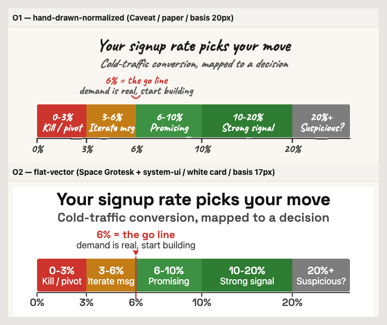

# 40.30 - Exemplar A/B: lesson 1.4 signal exhibit, O1 vs O2

**Purpose:** the style gate for ADR 30.09 Phase A. One M1 exhibit (lesson
1.4's smoke-test signal meter) rendered BOTH ways against the v3 exhibit
spec, so Paul's eye-test picks O1 (hand-drawn-normalized) or O2
(flat-vector). Neutral by design - this doc scores both on the same axes;
it does not pre-decide the call.

- **Exhibit rendered:** the cold-traffic conversion signal meter (visits →
  signups → the conversion rate that reads go / iterate / kill, with 6% as
  the go line). Same message in both variants; only the style variable moves.
- **Spec bound:** `.okf/design/house-visual-spec.md` "v3 exhibit spec"
  (grid W=720, 8-scale spacing, fill=data/stroke=structure, 5-rung type
  scale, the ≥9px @390px floor formula, exhibit grammar, O1/O2 rubric).
- **Files (do NOT overwrite the lesson's committed SVG):**
  - O1: `40.30-exemplar-1.4-O1.svg`
  - O2: `40.30-exemplar-1.4-O2.svg`
  - Side-by-side (equal zoom, real webfonts): `40.30-exemplar-ab-sidebyside.png`

## Side-by-side (equal zoom, rendered with the real webfonts)

O1 links: [40.30-exemplar-1.4-O1.svg](40.30-exemplar-1.4-O1.svg) ·
O2 links: [40.30-exemplar-1.4-O2.svg](40.30-exemplar-1.4-O2.svg)

> Rendering note: the standalone `.svg` files reference Caveat / Space
> Grotesk by family (the same way the lesson pages load them). Open them
> inside the course (fonts loaded) or view the PNG above for the faithful
> render - a raw file open with those fonts absent will substitute.

---

## Pass/fail gates (both MUST pass - not scored)

Grammar checklist and the measured floor are gates, not preferences. Both
variants clear both.

| Gate | O1 | O2 | Evidence |
|---|---|---|---|
| One action title (a takeaway sentence, not a label) | PASS | PASS | "Your signup rate picks your move" |
| One message (single point proved) | PASS | PASS | "Cold-traffic conversion, mapped to a decision" |
| One basis line (source + scope) | PASS | PASS | "Basis: form submits ÷ ad-campaign visits, 300 cold visitors, one channel" |
| Ruby-for-signal = one actionable reading | PASS | PASS | the 6% go line is the only ruby reading; bands are the gauge tone-scale |
| Fill=data / stroke=structure | PASS | PASS | bands filled no-stroke; axis, ticks, threshold stroked no-fill |
| Grid W=720, 8-scale spacing, 24 margins | PASS | PASS | 12:5 signal-meter ratio (720×300); every gap on the 4/8/12/16/24/32 rungs |
| **≥9px @390px legibility floor (measured)** | **PASS** | **PASS** | see below |

### Measured floor (the blocking gate) - real webfonts, container = 390px CSS

Smallest text in each exhibit is the **basis line**. Measured in Chrome with
Caveat / Space Grotesk actually loaded, the SVG scaled to a 390px container
(scale = 390/720 = 0.5417):

| Variant | Basis font (viewBox) | Rendered @390px | Floor (≥9px) | Font confirmed |
|---|---|---|---|---|
| O1 | 20px (Caveat x-height corrected) | **10.83px** | PASS (+1.83) | Caveat loaded |
| O2 | 17px | **9.21px** | PASS (+0.21) | system-ui basis, Space Grotesk title |

Both hold the floor by design (the spec's formula: O2 basis 17px → 9.21px;
O1 basis 20px → 10.83px). O2 sits closest to the floor (17px is the exact
canonical basis rung), which is correct - the spec sets it there on purpose.
All larger rungs clear automatically. Band labels also verified to fit
inside their bands with the real (condensed) fonts - tightest is O1
"Iterate msg" at 90.4 of 96 viewBox units.

---

## Scored axes (where the two legitimately diverge - Paul's eye resolves)

Same axes, both variants, 1-5. These are the trade-off, not a total: a high
score on one is often the mirror of a risk on another. No sum, no winner
declared.

| Axis | O1 hand-drawn-normalized | O2 premium-editorial flat-vector |
|---|---|---|
| Perceived craft / "consulting-grade" | 3 - clean and disciplined, but the hand style caps how "premium" it can read | 5 - Space Grotesk + 4px radius + white card reads editorial/Stripe-Press |
| Brand-identity fit (handwritten = house rule) | 5 - preserves the mermaid/Caveat brand rule intact | 2 - deliberately breaks it (that is the point of the test) |
| Sam-trust (anti-marketing, not amateur, not generic-startup) | 3 - warm and human, but ADR's Sam-lens flagged hand-drawn as "amateur / unfinished" | 3 - crisp and trustworthy, but risks "generic startup" if it reads too polished |
| Legibility at 390px | 4 - 10.83px basis, condensed Caveat stays readable | 4 - 9.21px basis, system-ui at the floor is clean and dense |
| Consistency across 81 SVGs (the loudest premium signal per ADR D3) | 3 - hand style drifts stroke/texture more easily across many files | 5 - geometric spec is far easier to hold identical at scale |
| Cost to adopt | 5 - cheapest, no restyle of the existing hand-drawn library | 2 - restyle every M1 SVG, then roll forward |

**How the axes cut:** O1 wins on brand-continuity, warmth, and cost; it is
the safe, cheap keep. O2 wins on perceived craft and scale-consistency -
the two things Paul's 2026-07-31 "old-time / lacks infographic quality"
assessment actually named - at the cost of breaking the handwritten house
rule and a full M1 restyle. Sam-trust is a genuine wash: each carries a
different, opposite risk (amateur vs generic), and only real reader signal
settles it. The exhibit above is deliberately the smoke-test signal meter
because its data-viz (semantic tone bands + ruby threshold) is where O2's
flat-vector discipline shows the most and O1's hand style shows its warmth -
the fairest single test of the divergence.

---

## Spec-ambiguity flags (rendered consistently across BOTH, so they don't bias the A/B)

1. **Gauge tone-scale vs the single-ruby / green=money-only rules.** The
   spec names `smoke-test-signal.svg` as THE gauge/meter archetype, whose
   whole encoding is a bad→good tonal scale (ruby kill → amber → green go →
   gray). That legitimately uses (a) red in the kill zone and (b) green in
   the go zones, which brushes against "ruby marks the ONE actionable
   reading" and "green stays money-only". Resolution used in BOTH variants:
   the gauge tone-scale is treated as the meter archetype's data encoding;
   the single hero **ruby** reading is reserved for the **6% go-line
   pointer** (the number the exhibit exists to show), and green reads as
   "go / proceed" not money. Applied identically to O1 and O2, so it does
   not tilt the comparison. If Paul wants the letter of green=money-only
   enforced, the go-zones would need a non-green positive tone (the palette
   has none today - worth a spec note before M1 rollout).

2. **Meter band widths are semi-linear, not strictly linear.** Low bands
   (0-3, 3-6) get readable width even though they are narrow percentage
   ranges, and 20%+ is a fixed cap. This matches the committed lesson SVG's
   treatment and keeps the decision-relevant low end legible; it is a
   meter-readability choice, identical in both.

3. **Class names are generic (`.title`, `.label`, `.basis`).** Matches the
   existing course-SVG convention and is correct for the shipping pattern
   (each SVG loads as its own `` document). Only collides if
   multiple of these SVGs are inlined into ONE HTML document - which the
   lesson pages never do. (This bit the render harness mid-build and was
   worked around by rendering each in isolation.)

## Method (repeatable)

- Rendered each SVG alone in an HTML page with Caveat + Space Grotesk from
  Google Fonts, `await document.fonts.ready`, measured the smallest text's
  computed font-size × (renderedWidth / viewBoxWidth) at a 390px container.
- Screenshotted each at 720px (equal zoom) for the side-by-side.
- Do NOT inline both SVGs in one page to measure - shared class names
  cross-contaminate sizes; render each isolated.
